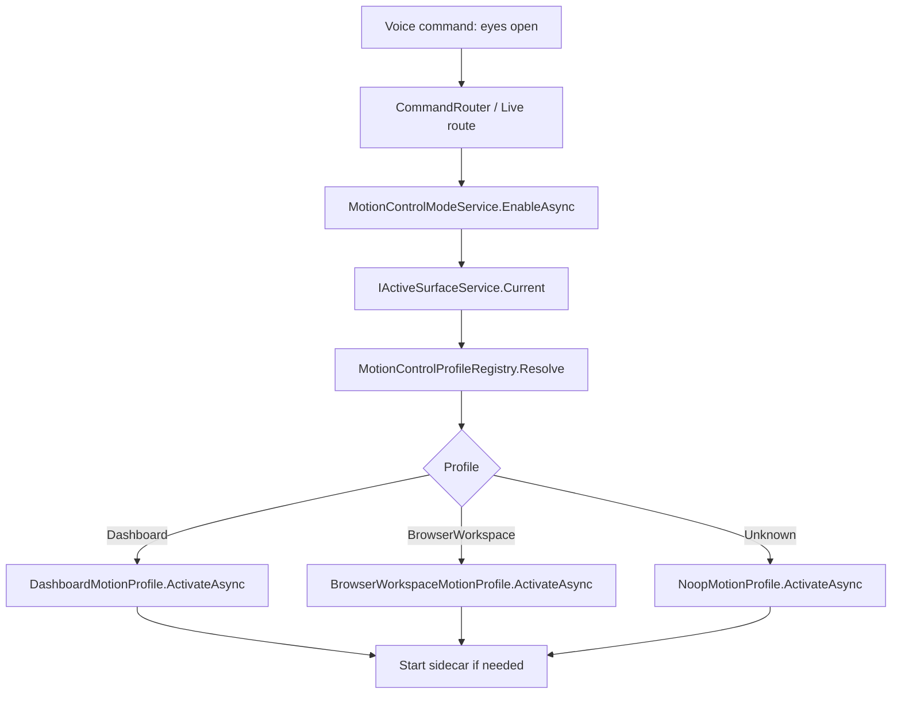
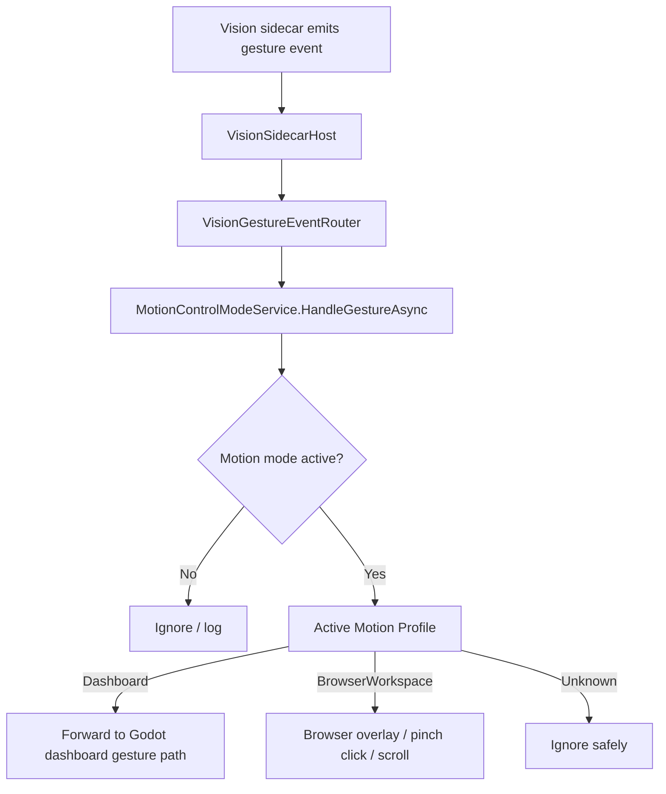
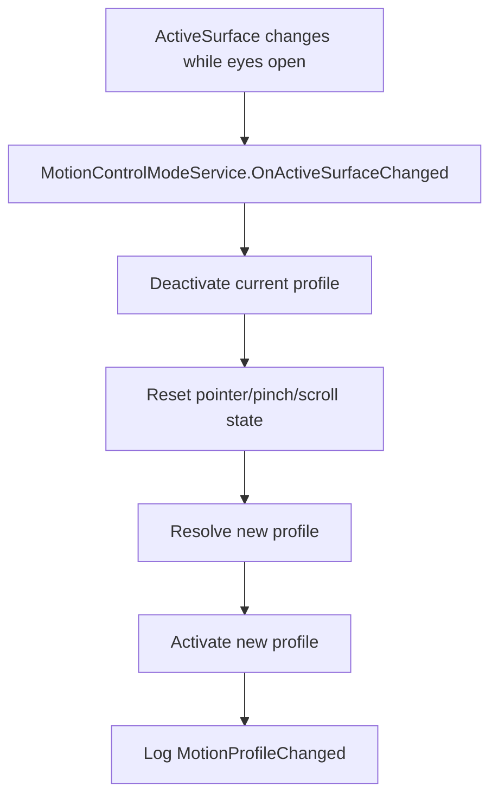

# Merlin Motion Control Profile Layer Implementation Plan

## Purpose

This document defines a practical implementation plan for moving Merlin motion control from separate feature-specific modes into a clean **profile-based motion architecture**.

The future user-facing model should be simple:

```text
User: "eyes open"
→ Merlin enables motion control
→ Merlin checks the current Active Surface
→ Merlin selects the correct Motion Control Profile
→ gestures mean the right thing for the current surface

User: "eyes closed"
→ Merlin disables motion control
→ active profile unloads
→ pointer/click/scroll state resets safely
→ camera tracking stops if no longer needed
```

The goal is not to invent new gestures yet. The goal is to **professionally separate ownership** so Dashboard motion, BrowserWorkspace motion, and future app/site motion controls can be added without turning `CommandRouter`, `VisionGestureEventRouter`, or Godot `Main.gd` into giant special-case systems.

This plan is based on the current motion-structure report and the current Active Surface architecture.

---

## Current Situation Summary

The report shows that Merlin currently has:

```text
one generic gesture/camera engine
+ two separate motion-control consumers
```

Current consumers:

1. **Dashboard / Merlin UI motion**
   - Started through UI control mode.
   - Rendered and interpreted mostly inside Godot `Main.gd`.
   - Supports dashboard pointer, hover, select, drag, resize, crumple/delete behavior.

2. **BrowserWorkspace motion**
   - Started through separate browser pointer commands.
   - Uses native BrowserHost overlay.
   - Supports pointer overlay, pinch click, and pinch-hold scroll.

The report identifies the main pain points:

```text
split ownership
separate sidecar start/stop paths
duplicated coordinate mapping/smoothing
profile decisions embedded in command routes
VisionGestureEventRouter directly knows feature consumers
dashboard behavior buried in a large Godot script
ActiveSurface exists but motion control does not consume it yet
```

The clean path is to wrap existing behavior as profiles first, then gradually move routing behind one profile dispatcher.

---

## Design Principle

The core separation should become:

```text
Gesture engine
→ detects hands, pointer coordinates, pinch, confidence, movement

ActiveSurfaceService
→ tells Merlin where the user is currently operating

MotionControlModeService
→ owns eyes-open / eyes-closed lifecycle

MotionControlProfileRegistry
→ chooses the correct profile for the active surface

IMotionControlProfile
→ defines what gestures mean for that surface

Safety / confirmation layers
→ decide whether requested actions are allowed
```

Do not let a gesture directly imply one universal behavior.

Bad:

```text
pinch always means click
```

Better:

```text
Dashboard profile:
  pinch = select UI item

BrowserWorkspace profile:
  pinch = click WebView2

Future SpotifyWidget profile:
  pinch = activate hovered widget control

Future FileBrowser profile:
  pinch = select/open file, with safety constraints
```

---

## Target Mental Model

The user should not need to remember separate commands such as:

```text
start ui control
start browser pointer
start browser hand control
stop browser pointer
stop ui control
```

Those can remain as compatibility aliases, but the new natural commands should be:

```text
eyes open
eyes closed
open your eyes
close your eyes
```

Internally:

```text
eyes open
→ motion_control.enable
→ select profile from ActiveSurface
```

```text
eyes closed
→ motion_control.disable
→ unload profile
```

The command does **not** decide whether motion control is Dashboard or BrowserWorkspace. The current active surface/profile decides that.

---

## V1 Scope

V1 should include only:

```text
DashboardMotionProfile
BrowserWorkspaceMotionProfile
Unknown/NoopMotionProfile
MotionControlModeService
MotionControlProfileRegistry
profile-aware VisionGestureEvent dispatch
```

V1 should **not** implement:

```text
YouTube-specific motion profile
Spotify widget profile
FileBrowser profile
Discord/WhatsApp/Steam profiles
external foreground-app detection
learned control DB
site profile learning
new gestures
new browser page-aware features
new dashboard visuals
OCR
```

The V1 goal is **architecture and behavior preservation**, not new functionality.

---

## Desired V1 Behavior

### Dashboard active

```text
ActiveSurface = Dashboard
User says: eyes open
→ MotionControlModeService starts
→ DashboardMotionProfile selected
→ existing dashboard UI control behavior starts
→ Godot shows gesture cursor
→ pinch/select/drag/resize/crumple behavior works as before
```

```text
User says: eyes closed
→ DashboardMotionProfile deactivates
→ Godot receives UI_CONTROL_MODE_STOPPED
→ dashboard gesture state resets
→ sidecar stops if no other profile needs it
```

### BrowserWorkspace active

```text
ActiveSurface = BrowserWorkspace
User says: eyes open
→ MotionControlModeService starts
→ BrowserWorkspaceMotionProfile selected
→ browser native pointer overlay starts
→ pinch click works
→ pinch-hold scroll works
```

```text
User says: eyes closed
→ BrowserWorkspaceMotionProfile deactivates
→ overlay hides
→ pinch/scroll state resets
→ sidecar stops if no other profile needs it
```

### Unknown active surface

```text
ActiveSurface = Unknown
User says: eyes open
→ safe neutral/noop profile selected
→ camera may start if useful, or command may respond that no controllable surface is active
→ no click/scroll/high-impact motion actions are allowed
```

Recommended V1 behavior for Unknown:

```text
Do not click.
Do not scroll.
Do not start dashboard UI drag.
Optionally show no pointer.
Return a short response such as: "I do not know what to control yet."
```

---

## Compatibility Behavior

Existing commands should continue working during the migration:

```text
open your eyes
close your eyes
start ui control
stop ui control
start browser pointer
stop browser pointer
start browser hand control
stop browser hand control
```

But after the migration, these should route through the profile layer where possible.

Recommended compatibility mapping:

```text
open your eyes / eyes open
→ generic MotionControlModeService.EnableAsync()
→ profile selected from current ActiveSurface
```

```text
close your eyes / eyes closed
→ generic MotionControlModeService.DisableAsync()
```

```text
start ui control
→ either:
   A. set/request Dashboard surface, then enable motion mode
   B. directly enable DashboardMotionProfile as explicit profile override
```

```text
start browser pointer
→ either:
   A. set/request BrowserWorkspace surface, then enable motion mode
   B. directly enable BrowserWorkspaceMotionProfile as explicit profile override
```

For V1, option B is acceptable for compatibility, but the long-term model should prefer active-surface selection.

---

## Target Architecture







---

## Proposed Backend Layout

Suggested new folder:

```text
Merlin.Backend/
  Services/
    MotionControl/
      IMotionControlModeService.cs
      MotionControlModeService.cs
      MotionControlModeState.cs
      MotionControlModeSnapshot.cs
      MotionControlCommandMatcher.cs

      Profiles/
        IMotionControlProfile.cs
        MotionControlProfileDescriptor.cs
        MotionControlProfileRegistry.cs
        MotionControlProfileResolution.cs
        MotionControlProfileCapabilities.cs
        MotionControlProfileActivationContext.cs
        MotionControlGestureContext.cs

        Dashboard/
          DashboardMotionProfile.cs

        BrowserWorkspace/
          BrowserWorkspaceMotionProfile.cs

        Unknown/
          NoopMotionProfile.cs
```

Avoid placing this under BrowserWorkspace. BrowserWorkspace is one profile provider, not the owner of motion control.

---

## Core Models

### MotionControlModeState

```csharp
public enum MotionControlModeState
{
    Disabled = 0,
    Enabling = 1,
    Enabled = 2,
    SwitchingProfile = 3,
    Disabling = 4,
    Faulted = 5
}
```

### MotionControlModeSnapshot

```csharp
public sealed record MotionControlModeSnapshot(
    MotionControlModeState State,
    bool IsEnabled,
    string? ActiveProfileId,
    string? ActiveProfileDisplayName,
    ActiveSurfaceSnapshot ActiveSurface,
    DateTimeOffset UpdatedUtc,
    string Reason
);
```

### IMotionControlModeService

```csharp
public interface IMotionControlModeService
{
    MotionControlModeSnapshot Current { get; }

    Task<MotionControlModeSnapshot> EnableAsync(
        string reason,
        MotionControlProfileOverride? profileOverride = null,
        CancellationToken cancellationToken = default);

    Task<MotionControlModeSnapshot> DisableAsync(
        string reason,
        CancellationToken cancellationToken = default);

    Task HandleGestureAsync(
        VisionGestureEvent gestureEvent,
        CancellationToken cancellationToken = default);

    Task OnActiveSurfaceChangedAsync(
        ActiveSurfaceSnapshot activeSurface,
        string reason,
        CancellationToken cancellationToken = default);

    bool IsEnabled { get; }
}
```

### MotionControlProfileOverride

Useful for compatibility commands like `start browser pointer`.

```csharp
public sealed record MotionControlProfileOverride(
    string ProfileId,
    string Reason
);
```

V1 may omit this if unnecessary, but it is useful to avoid breaking old commands.

---

## Profile Interfaces

### IMotionControlProfile

```csharp
public interface IMotionControlProfile
{
    MotionControlProfileDescriptor Descriptor { get; }

    bool CanHandle(ActiveSurfaceSnapshot surface);

    Task ActivateAsync(
        MotionControlProfileActivationContext context,
        CancellationToken cancellationToken = default);

    Task DeactivateAsync(
        string reason,
        CancellationToken cancellationToken = default);

    Task HandleGestureAsync(
        MotionControlGestureContext context,
        CancellationToken cancellationToken = default);

    Task OnActiveSurfaceChangedAsync(
        ActiveSurfaceSnapshot surface,
        CancellationToken cancellationToken = default);
}
```

### MotionControlProfileDescriptor

```csharp
public sealed record MotionControlProfileDescriptor(
    string ProfileId,
    string DisplayName,
    ActiveSurfaceKind SurfaceKind,
    int Priority,
    IReadOnlySet<string> Capabilities,
    IReadOnlyDictionary<string, string> Metadata
);
```

Suggested profile IDs:

```text
motion.dashboard
motion.browser_workspace
motion.unknown
```

Future IDs:

```text
motion.browser.youtube
motion.widget.spotify
motion.file_browser
motion.external.discord
```

### MotionControlProfileCapabilities

```csharp
public static class MotionControlProfileCapabilities
{
    public const string Pointer = "motion.pointer";
    public const string Hover = "motion.hover";
    public const string Select = "motion.select";
    public const string Drag = "motion.drag";
    public const string Resize = "motion.resize";
    public const string Dismiss = "motion.dismiss";

    public const string BrowserPointerOverlay = "motion.browser.pointer_overlay";
    public const string BrowserClick = "motion.browser.click";
    public const string BrowserScroll = "motion.browser.scroll";

    public const string SafeNoop = "motion.safe_noop";
}
```

### MotionControlProfileActivationContext

```csharp
public sealed record MotionControlProfileActivationContext(
    ActiveSurfaceSnapshot ActiveSurface,
    string Reason,
    DateTimeOffset ActivatedUtc
);
```

### MotionControlGestureContext

```csharp
public sealed record MotionControlGestureContext(
    VisionGestureEvent GestureEvent,
    ActiveSurfaceSnapshot ActiveSurface,
    MotionControlModeSnapshot ModeSnapshot,
    DateTimeOffset ReceivedUtc
);
```

---

## Profile Registry

### IMotionControlProfileRegistry

```csharp
public interface IMotionControlProfileRegistry
{
    MotionControlProfileResolution Resolve(
        ActiveSurfaceSnapshot activeSurface,
        MotionControlProfileOverride? profileOverride = null);

    IReadOnlyList<MotionControlProfileDescriptor> ListProfiles();
}
```

### MotionControlProfileResolution

```csharp
public sealed record MotionControlProfileResolution(
    IMotionControlProfile Profile,
    double Confidence,
    string Reason
);
```

### V1 resolution rules

```text
If explicit override ProfileId is dashboard and Dashboard profile exists:
  return DashboardMotionProfile

If explicit override ProfileId is browser workspace and BrowserWorkspace profile exists:
  return BrowserWorkspaceMotionProfile

If ActiveSurface.Kind == Dashboard:
  return DashboardMotionProfile

If ActiveSurface.Kind == BrowserWorkspace:
  return BrowserWorkspaceMotionProfile

Otherwise:
  return NoopMotionProfile
```

### Future resolution rules

Future registry can add domain/app metadata resolution:

```text
ActiveSurface.Kind = BrowserWorkspace
metadata.domain = youtube.com
→ YouTubeMotionProfile if installed
→ otherwise BrowserWorkspaceMotionProfile
```

Do not implement this in V1 beyond leaving room for it.

---

## MotionControlModeService Responsibilities

`MotionControlModeService` should become the central owner of motion lifecycle.

Responsibilities:

1. Own whether motion control is enabled.
2. Own the currently active profile.
3. Start camera tracking once when motion mode enables.
4. Stop camera tracking once when motion mode disables, unless future shared consumers require otherwise.
5. Resolve the active profile using `IActiveSurfaceService.Current`.
6. Activate/deactivate profiles.
7. Reset profile state on disable and profile switch.
8. Dispatch gesture events to exactly one active profile.
9. Handle active-surface changes while enabled.
10. Produce structured logs.

It should not:

```text
interpret dashboard gestures itself
interpret browser gestures itself
own Godot rendering
own BrowserHost rendering
perform raw clicks itself
perform page-aware browser actions itself
```

Profiles own interpretation; existing services own implementation details.

---

## DashboardMotionProfile

### Current implementation to wrap

Existing dashboard motion is mostly:

```text
Merlin.Backend/Services/UiControlModeController.cs
Merlin.Backend/WebSocket/WebSocketHandler.cs
Merlin.Frontend/Scripts/Main.gd
Merlin.Frontend/Scripts/UI/Windows/*.gd
```

Dashboard profile should initially be a **thin adapter**, not a rewrite of Godot gesture logic.

### Activation

On activation:

```text
UiControlModeController.Start()
WebSocket/Godot receives UI_CONTROL_MODE_STARTED through existing path
Godot _ui_control_mode_active = true
```

Depending on existing routing, this may require either:

1. Calling existing `UiControlModeController.Start()` and reusing existing visual event dispatch.
2. Extracting visual event dispatch into a reusable service if currently only done by `CommandRouter` response flow.

Avoid duplicating `UI_CONTROL_MODE_STARTED` logic.

### Deactivation

On deactivation:

```text
UiControlModeController.Stop()
Godot receives UI_CONTROL_MODE_STOPPED
Godot clears dashboard gesture state
```

### Gesture handling

V1 options:

1. Keep `VisionGestureEventRouter.GestureEventForwarded` and existing `WebSocketHandler.SendVisionGestureEventAsync` path for dashboard gestures.
2. Or make `DashboardMotionProfile.HandleGestureAsync` explicitly forward the gesture to frontend.

Recommended V1:

```text
Do the smallest safe adapter.
Preserve existing frontend behavior.
Do not rewrite Main.gd.
```

The end state should still make the profile manager the only high-level consumer, but this can happen gradually.

### Dashboard profile capabilities

```text
motion.pointer
motion.hover
motion.select
motion.drag
motion.resize
motion.dismiss
```

### Dashboard profile acceptance criteria

```text
eyes open while Dashboard active starts existing dashboard hand control
eyes closed stops existing dashboard hand control
existing start ui control still works
existing stop ui control still works
dashboard pointer/hover/select/drag/resize/crumple behavior still works
no browser overlay starts in Dashboard profile
```

---

## BrowserWorkspaceMotionProfile

### Current implementation to wrap

Existing browser motion is already service-shaped:

```text
BrowserMotionOverlayModeService
BrowserPointerMapper
BrowserPointerRenderState
BrowserPinchClickController
BrowserPinchClickStateMachine
BrowserScrollCommandService
BrowserWorkspaceService
NativeBrowserPointerOverlayWindow
NativeBrowserInputService
```

### Activation

On activation:

```text
BrowserMotionOverlayModeService.EnableAsync("motion_profile_activated")
```

Preconditions:

```text
BrowserWorkspaceService.IsActive must be true
BrowserHost bounds should be available
```

If browser is not active/open:

```text
activation should fail gracefully
MotionControlModeService should either fall back to NoopMotionProfile or disable motion mode
```

Recommended V1:

```text
If ActiveSurface says BrowserWorkspace but BrowserWorkspaceService is not active, select NoopMotionProfile or return a short failure.
Do not auto-open browser just because eyes open was said.
```

### Deactivation

On deactivation:

```text
BrowserMotionOverlayModeService.DisableAsync("motion_profile_deactivated")
BrowserPinchClickController.ResetAsync("profile_deactivated")
BrowserScrollCommandService.Reset()
Native overlay receives inactive state/hides
```

If reset methods do not exist, add the smallest explicit reset method needed. Do not rely on object disposal for gesture state reset.

### Gesture handling

On gesture event:

```text
BrowserMotionOverlayModeService.UpdatePointerAsync(event)
BrowserPinchClickController.HandleGestureAsync(event)
```

Be careful to preserve current order from `VisionGestureEventRouter` if order matters.

Likely desired order:

```text
pointer move/update first
then pinch click/scroll controller reads latest render state
```

Check current `VisionGestureEventRouter.RouteAsync` order and preserve behavior.

### Browser profile capabilities

```text
motion.pointer
motion.browser.pointer_overlay
motion.browser.click
motion.browser.scroll
```

Optional metadata:

```text
surfaceId = browser.workspace.main
domain = activeSurface.Metadata["domain"] if present
url = activeSurface.Metadata["url"] if present
title = activeSurface.Metadata["title"] if present
```

### Browser profile acceptance criteria

```text
eyes open while BrowserWorkspace active starts native browser pointer overlay
pointer follows hand
pinch click still works
pinch-hold scroll still works
scroll release still does not click
eyes closed hides overlay and prevents click/scroll
existing start browser pointer still works
existing stop browser pointer still works
no dashboard UI cursor starts in Browser profile
```

---

## NoopMotionProfile

Purpose:

```text
safe fallback for Unknown or unsupported active surfaces
```

Behavior:

```text
ActivateAsync:
  log selected noop profile
  optionally do nothing else

HandleGestureAsync:
  ignore gesture
  optionally log low-frequency MotionGestureRejected

DeactivateAsync:
  no-op
```

This avoids dangerous behavior when Merlin does not know what surface the user is controlling.

Acceptance criteria:

```text
eyes open with Unknown surface does not click or scroll anything
gestures are ignored safely
logs explain why profile is noop
```

---

## VisionGestureEventRouter Migration

The report identifies `VisionGestureEventRouter` as a direct coupling point. Today it routes gestures to browser services and frontend/dashboard paths.

### Current shape

```text
VisionGestureEventRouter
→ browser services if browser pointer mode active
→ frontend gesture event forwarding if UI control or browser pointer mode active
```

### Target shape

```text
VisionGestureEventRouter
→ MotionControlModeService.HandleGestureAsync(event)
```

Only one active profile should consume gestures.

### Recommended migration path

Do this in stages.

#### Stage A: Add profile dispatch alongside existing behavior behind a flag/test seam

Do not risk breaking current behavior immediately.

#### Stage B: Move browser handling into BrowserWorkspaceMotionProfile

Remove direct browser service dependencies from `VisionGestureEventRouter` after tests prove behavior is preserved.

#### Stage C: Move dashboard forwarding into DashboardMotionProfile

Keep Godot implementation intact but route events through profile.

#### Stage D: Router becomes generic

Final desired responsibility:

```text
VisionGestureEventRouter receives VisionGestureEvent
if MotionControlModeService.IsEnabled:
    MotionControlModeService.HandleGestureAsync(event)
else:
    ignore/log
```

### Important rule

When profile dispatcher is active, **do not let both dashboard and browser consume the same gesture**.

The report explicitly calls out the current gap: UI/browser modes can both exist as consumers, and profile architecture should fix that.

---

## Command Routing Migration

### Current command entry points

Dashboard motion:

```text
UiControlModeCommandMatcher
CommandRouter.RouteAsync
UiControlModeController.Start/Stop
IVisionSidecarHost.StartTrackingAsync/StopTrackingAsync
```

Browser motion:

```text
WebDestinationParser
CommandRouter.HandleWebDestinationCommandAsync
BrowserMotionOverlayModeService.Enable/Disable
IVisionSidecarHost.StartTrackingAsync/StopTrackingAsync
```

### Target command model

New generic commands:

```text
eyes open
open your eyes
start motion control
enable motion control


eyes closed
close your eyes
stop motion control
disable motion control
```

All should route to:

```text
MotionControlModeService.EnableAsync(...)
MotionControlModeService.DisableAsync(...)
```

### Compatibility commands

Existing command aliases should remain.

```text
start ui control
→ enable motion control with Dashboard override or Dashboard surface request

stop ui control
→ if active profile is Dashboard, disable motion control or deactivate Dashboard profile

start browser pointer
→ enable motion control with BrowserWorkspace override or BrowserWorkspace surface request

stop browser pointer
→ if active profile is BrowserWorkspace, disable motion control or deactivate BrowserWorkspace profile
```

### Recommended V1 compatibility policy

For minimal risk:

```text
eyes open/open your eyes:
  generic enable using current ActiveSurface

start ui control:
  explicit Dashboard override

start browser pointer:
  explicit BrowserWorkspace override
```

This preserves old intent while making `eyes open` surface-aware.

---

## ActiveSurface Integration

`IActiveSurfaceService` already exists and is currently used for command routing, but motion does not consume it.

### V1 enable-time profile selection

On `MotionControlModeService.EnableAsync`:

```csharp
var surface = _activeSurfaceService.Current;
var resolution = _profileRegistry.Resolve(surface, profileOverride);
await resolution.Profile.ActivateAsync(...);
```

This gives deterministic behavior at the moment the user says `eyes open`.

### V2 live profile switching

When ActiveSurface changes while motion mode is enabled:

```text
current profile deactivates
all pointer/pinch/scroll state resets
new profile resolves
new profile activates
motion continues under the new surface
```

V1 can implement live switching if it is clean. If not, implement the hooks and logs, but keep switching conservative.

Recommended V1 rule:

```text
If motion mode is enabled and ActiveSurface changes between Dashboard and BrowserWorkspace:
  switch profiles automatically.
```

Fallback if this is too risky:

```text
Log that active surface changed while motion mode is enabled.
Do not switch until eyes closed/open cycle.
```

But the desired architecture is automatic switching with safe reset.

### Surface change reset rule

Every profile switch must reset:

```text
pinch state
scroll state
current profile pointer visual state
pending click state
dashboard drag/resize/crumple state
browser overlay state
```

Do not carry a pinch from Dashboard into BrowserWorkspace or vice versa.

---

## Sidecar Lifecycle

The report shows both UI and browser commands start/stop tracking independently. The profile layer should centralize this.

### Target ownership

```text
MotionControlModeService owns motion-control-related sidecar start/stop.
Profiles do not directly decide whether the camera process exists.
Profiles may declare whether they require tracking.
```

### Profile requirement

Add descriptor field if useful:

```csharp
bool RequiresVisionTracking
```

or capability:

```text
motion.requires_vision_tracking
```

V1 can assume Dashboard and BrowserWorkspace require tracking.

### Enable behavior

```text
MotionControlModeService.EnableAsync:
  resolve profile
  if profile requires tracking:
      IVisionSidecarHost.StartTrackingAsync()
  profile.ActivateAsync()
```

### Disable behavior

```text
MotionControlModeService.DisableAsync:
  activeProfile.DeactivateAsync()
  IVisionSidecarHost.StopTrackingAsync()
```

### Important caution

If there are future non-profile consumers of the sidecar, stop behavior must become reference-counted or ownership-aware.

For V1, centralizing through motion mode is acceptable, but avoid breaking calibration flows:

```text
calibrate pinch
calibrate motion region
```

These currently start UI control/tracking and run calibration after speech. Keep calibration working.

---

## Calibration Behavior

Current calibration phrases:

```text
calibrate pinch
open your eyes calibrate pinch
eyes open calibrate pinch
calibrate motion region
calibrate control region
calibrate browser pointer region
```

Do not break these.

Recommended V1:

```text
Calibration remains handled by existing CommandRouter/WebSocketHandler calibration path.
Motion profile layer may start motion mode first if needed, but do not redesign calibration yet.
```

Future:

```text
calibration should become generic motion calibration, not dashboard-specific.
```

But keep this out of the initial refactor.

---

## Safety Model

The profile layer must not bypass existing safety.

### Browser motion click

Current raw browser pointer click uses OS input and does not go through `BrowserPageSafetyGuard`. This is acceptable for direct hand click behavior, but the profile layer should make that explicit.

Browser profile should include a motion safety policy:

```text
Raw pointer click is allowed only when:
  browser workspace active
  overlay active
  hand reliable
  pointer in bounds
  pinch state valid
  cooldown not active
```

This preserves current behavior.

### Risky semantic actions

Future profile actions like:

```text
click delete
click buy
send message
delete file
```

must use safety/confirmation.

But V1 profile layer should not implement semantic actions. It only wraps existing pointer/click/scroll behavior.

### Profile switch safety

On profile switch:

```text
cancel pending click
cancel pending scroll
release dashboard drag/resize state
hide/deactivate profile-specific visuals
enter neutral state before next profile starts
```

---

## Logging / Observability

Add structured logs from day one.

### Required log events

```text
MotionControlEnableRequested
MotionControlEnabled
MotionControlDisableRequested
MotionControlDisabled
MotionControlEnableRejected
MotionControlFaulted
MotionProfileResolveRequested
MotionProfileSelected
MotionProfileActivated
MotionProfileDeactivated
MotionProfileChanged
MotionGestureReceived
MotionGestureDispatched
MotionGestureRejected
MotionProfileAction
```

### Important log fields

```text
CorrelationId
Reason
ProfileId
PreviousProfileId
ActiveSurfaceKind
ActiveSurfaceId
ActiveSurfaceSource
ActiveSurfaceConfidence
GestureType
PointerId
Confidence
RejectReason
```

Do not log excessive frame-by-frame data unless debug logging is enabled.

### Specific gap to fix

The report notes that no single log currently links ActiveSurface snapshot to motion behavior selection. Add that.

Example:

```json
{
  "event": "MotionProfileSelected",
  "profileId": "motion.browser_workspace",
  "activeSurfaceKind": "BrowserWorkspace",
  "activeSurfaceId": "browser.workspace.main",
  "activeSurfaceSource": "BrowserWorkspace",
  "activeSurfaceConfidence": 1.0,
  "reason": "eyes_open"
}
```

---

## Tests

### New test files

Suggested:

```text
Merlin.Backend.Tests/MotionControlModeServiceTests.cs
Merlin.Backend.Tests/MotionControlProfileRegistryTests.cs
Merlin.Backend.Tests/DashboardMotionProfileTests.cs
Merlin.Backend.Tests/BrowserWorkspaceMotionProfileTests.cs
Merlin.Backend.Tests/VisionGestureEventRouterProfileDispatchTests.cs
Merlin.Backend.Tests/CommandRouterMotionControlCommandTests.cs
```

### MotionControlProfileRegistry tests

Required:

```text
Dashboard surface resolves DashboardMotionProfile
BrowserWorkspace surface resolves BrowserWorkspaceMotionProfile
Unknown surface resolves NoopMotionProfile
Explicit Dashboard override resolves Dashboard profile
Explicit BrowserWorkspace override resolves Browser profile
BrowserWorkspace profile not selected for Dashboard surface
Registry returns descriptors for all profiles
```

### MotionControlModeService tests

Required:

```text
default state is Disabled
eyes-open enable selects profile from ActiveSurface
enable starts sidecar once
enable activates selected profile
disable deactivates active profile
disable stops sidecar once
repeated enable is idempotent or safely handled
repeated disable is idempotent or safely handled
gesture ignored when disabled
gesture dispatched to active profile when enabled
profile switch deactivates old profile before activating new one
profile switch resets old profile state
activation failure leaves safe state
```

### DashboardMotionProfile tests

Required:

```text
Activate calls UiControlModeController.Start or equivalent
Deactivate calls UiControlModeController.Stop or equivalent
HandleGesture forwards gesture to dashboard/frontend path if that is profile-owned
No browser services are called
Capabilities include pointer/select/drag/resize/dismiss
```

### BrowserWorkspaceMotionProfile tests

Required:

```text
Activate calls BrowserMotionOverlayModeService.EnableAsync
Deactivate calls BrowserMotionOverlayModeService.DisableAsync
Deactivate resets BrowserPinchClickController
HandleGesture updates pointer before pinch/click/scroll handling
Browser profile refuses or fails safely when BrowserWorkspace inactive
No dashboard UI control visual event is emitted
Capabilities include browser pointer/click/scroll
```

### VisionGestureEventRouter dispatch tests

Required:

```text
when motion mode disabled, gesture is ignored
when Dashboard profile active, gesture goes only to Dashboard profile
when Browser profile active, gesture goes only to Browser profile
browser and dashboard do not both consume same event
pinch end events still reach active profile
multiple pointer ids are preserved
```

### CommandRouter tests

Required:

```text
eyes open routes to MotionControlModeService.EnableAsync
eyes closed routes to MotionControlModeService.DisableAsync
open your eyes remains supported
close your eyes remains supported
start ui control remains supported
stop ui control remains supported
start browser pointer remains supported
stop browser pointer remains supported
calibrate pinch still works
calibrate motion region still works
```

### Regression tests

Required:

```text
existing BrowserMotionOverlayModeServiceTests still pass
existing BrowserPinchClickControllerTests still pass
existing VisionGestureEventRouterTests are updated, not removed
existing CommandRouterTests still pass
existing ActiveSurfaceServiceTests still pass
existing BrowserMediaCommandNormalizerTests still pass
```

---

## Manual Validation Plan

### Dashboard validation

```text
Start Merlin.
Ensure ActiveSurface = Dashboard.
Say: eyes open.
Move hand.
Verify dashboard gesture cursor appears.
Pinch a dashboard element.
Verify selection works.
Pinch-hold and drag a window if supported.
Verify drag works.
Say: eyes closed.
Verify dashboard cursor disappears and gestures stop.
```

### Browser validation

```text
Open Browser Workspace.
Verify ActiveSurface = BrowserWorkspace.
Say: eyes open.
Verify native browser pointer overlay appears.
Move hand.
Verify pointer tracks over WebView2.
Pinch a search box/link.
Verify click works.
Pinch-hold and move vertically.
Verify scroll works.
Say: eyes closed.
Verify overlay hides.
Verify pinch no longer clicks.
```

### Profile switching validation

```text
Start on Dashboard.
Say: eyes open.
Verify Dashboard profile active.
Open/focus Browser Workspace.
If live switching is implemented:
  verify Dashboard profile deactivates.
  verify BrowserWorkspace profile activates.
  verify dashboard cursor disappears.
  verify browser overlay appears.
Close Browser Workspace.
Verify profile returns to Dashboard or disables safely, depending V1 behavior.
```

### Compatibility validation

```text
start ui control
stop ui control
start browser pointer
stop browser pointer
open your eyes
close your eyes
eyes open
eyes closed
calibrate pinch
calibrate motion region
```

All should behave safely.

---

## Implementation Phases

The following phases are designed for an agent to implement one at a time.

---

# Phase 1: Motion Mode Shell

## Goal

Add a generic `MotionControlModeService` without moving all routing yet.

## Deliverables

1. Add `Services/MotionControl` folder.
2. Add `MotionControlModeState`.
3. Add `MotionControlModeSnapshot`.
4. Add `IMotionControlModeService`.
5. Add `MotionControlModeService`.
6. Register in DI.
7. Add basic logs.
8. Add tests for enable/disable lifecycle with fake profiles or no profile yet.

## Behavior

For Phase 1, the service can be mostly a shell:

```text
EnableAsync changes state to Enabled.
DisableAsync changes state to Disabled.
HandleGestureAsync ignores until profiles are added.
```

Do not change existing UI/browser motion behavior yet.

## Acceptance criteria

```text
Backend builds.
MotionControlModeService is registered.
Default state is Disabled.
Enable/disable is idempotent and thread-safe.
Existing tests pass.
No motion behavior changes yet.
```

## Agent prompt

```text
You are working in the Merlin repository.

Implement Phase 1 of the Motion Control Profile Layer: the generic Motion Mode shell.

Do not change existing motion behavior yet.
Do not move Dashboard or BrowserWorkspace gesture routing yet.
Do not add profiles yet unless a tiny fake/test profile is needed.

Add:
- Services/MotionControl/IMotionControlModeService.cs
- Services/MotionControl/MotionControlModeService.cs
- Services/MotionControl/MotionControlModeState.cs
- Services/MotionControl/MotionControlModeSnapshot.cs

Requirements:
1. Motion mode defaults to Disabled.
2. EnableAsync transitions to Enabled.
3. DisableAsync transitions to Disabled.
4. Repeated enable/disable is safe.
5. Service is thread-safe.
6. Register in DI.
7. Add structured logs:
   - MotionControlEnableRequested
   - MotionControlEnabled
   - MotionControlDisableRequested
   - MotionControlDisabled
8. Add unit tests for default state, enable, disable, repeated calls, and concurrent reads.

Constraints:
- Do not alter existing UI control behavior.
- Do not alter existing browser pointer behavior.
- Do not alter VisionGestureEventRouter yet.
- Do not alter CommandRouter command behavior yet except registering service if needed.
- Existing tests must pass.

Report files changed, tests added, and any limitations.
```

---

# Phase 2: Profile Interfaces and Registry

## Goal

Add profile abstractions and registry, but keep existing routing behavior unchanged.

## Deliverables

1. Add `IMotionControlProfile`.
2. Add `MotionControlProfileDescriptor`.
3. Add `MotionControlProfileCapabilities`.
4. Add `MotionControlProfileActivationContext`.
5. Add `MotionControlGestureContext`.
6. Add `IMotionControlProfileRegistry`.
7. Add `MotionControlProfileRegistry`.
8. Add `NoopMotionProfile`.
9. Add stub `DashboardMotionProfile` and `BrowserWorkspaceMotionProfile` if useful, but do not wire gesture handling yet.
10. Add tests for resolution.

## Acceptance criteria

```text
Dashboard ActiveSurface resolves Dashboard profile.
BrowserWorkspace ActiveSurface resolves Browser profile.
Unknown resolves Noop profile.
Registry is deterministic.
No existing behavior changes yet.
```

## Agent prompt

```text
You are working in the Merlin repository.

Implement Phase 2 of the Motion Control Profile Layer: profile interfaces and registry.

Do not move gesture routing yet.
Do not change CommandRouter behavior yet.
Do not change existing UI/browser motion behavior yet.

Add profile abstractions under Services/MotionControl/Profiles.

Required types:
- IMotionControlProfile
- MotionControlProfileDescriptor
- MotionControlProfileCapabilities
- MotionControlProfileActivationContext
- MotionControlGestureContext
- IMotionControlProfileRegistry
- MotionControlProfileRegistry
- NoopMotionProfile

Also add thin/stub profiles if clean:
- DashboardMotionProfile
- BrowserWorkspaceMotionProfile

Profile IDs:
- motion.dashboard
- motion.browser_workspace
- motion.unknown

Registry resolution rules:
1. ActiveSurfaceKind.Dashboard -> Dashboard profile.
2. ActiveSurfaceKind.BrowserWorkspace -> BrowserWorkspace profile.
3. Unknown or unsupported -> NoopMotionProfile.
4. Explicit override support is optional in this phase, but leave room for it.

Register profiles and registry in DI.

Tests:
- Dashboard resolves DashboardMotionProfile.
- BrowserWorkspace resolves BrowserWorkspaceMotionProfile.
- Unknown resolves NoopMotionProfile.
- Registry exposes descriptors.
- Noop profile ignores gestures safely.

Constraints:
- No new user-facing behavior yet.
- No sidecar start/stop changes yet.
- Existing tests must pass.

Report files changed and tests added.
```

---

# Phase 3: Wire Eyes Open / Eyes Closed to MotionControlModeService

## Goal

Make `eyes open` / `eyes closed` the generic motion-control commands.

## Deliverables

1. Add `MotionControlCommandMatcher` or extend `UiControlModeCommandMatcher` carefully.
2. Support exact standalone:
   - `eyes open`
   - `eyes closed`
3. Preserve existing:
   - `open your eyes`
   - `close your eyes`
4. Route generic motion commands to `MotionControlModeService`.
5. On enable, resolve profile from `ActiveSurfaceService.Current` and activate it.
6. On disable, deactivate profile and disable motion mode.
7. Start/stop sidecar centrally for generic motion commands.

## Important compatibility choice

At this phase, existing `start ui control` and `start browser pointer` can still use old paths, or can be adapted with explicit profile overrides. Choose the least risky path and document it.

## Acceptance criteria

```text
eyes open enables motion mode and selects profile from ActiveSurface.
eyes closed disables motion mode and deactivates profile.
open your eyes still works.
close your eyes still works.
Dashboard active -> Dashboard profile selected.
BrowserWorkspace active -> Browser profile selected.
```

## Agent prompt

```text
You are working in the Merlin repository.

Implement Phase 3 of the Motion Control Profile Layer: route generic eyes-open / eyes-closed commands to MotionControlModeService.

Goal:
- "eyes open" enables generic motion control.
- "eyes closed" disables generic motion control.
- The active profile is chosen from IActiveSurfaceService.Current.

Requirements:
1. Add or update a deterministic command matcher for generic motion commands.
2. Support:
   - eyes open
   - open your eyes
   - start motion control
   - enable motion control
   - eyes closed
   - close your eyes
   - stop motion control
   - disable motion control
3. Preserve calibration phrases:
   - calibrate pinch
   - eyes open calibrate pinch
   - open your eyes calibrate pinch
   - calibrate motion region
4. On generic enable:
   - get active surface snapshot
   - resolve profile via MotionControlProfileRegistry
   - start vision sidecar if selected profile requires tracking
   - activate profile
   - set MotionControlModeService enabled
5. On generic disable:
   - deactivate active profile
   - stop vision sidecar if motion mode owns it
   - set disabled
6. Add logs:
   - MotionProfileResolveRequested
   - MotionProfileSelected
   - MotionProfileActivated
   - MotionProfileDeactivated

Constraints:
- Do not break existing start ui control / stop ui control.
- Do not break existing start browser pointer / stop browser pointer.
- Do not move VisionGestureEventRouter yet unless required.
- Existing tests must pass.

Tests:
- eyes open routes to MotionControlModeService.EnableAsync.
- eyes closed routes to MotionControlModeService.DisableAsync.
- open your eyes remains supported.
- close your eyes remains supported.
- Dashboard active selects Dashboard profile.
- BrowserWorkspace active selects BrowserWorkspace profile.
- Unknown active selects Noop profile.
- calibration commands still route as before.

Report files changed, tests added, and compatibility decisions.
```

---

# Phase 4: DashboardMotionProfile Adapter

## Goal

Wrap existing Dashboard UI control behavior as a profile without rewriting Godot `Main.gd`.

## Deliverables

1. `DashboardMotionProfile.ActivateAsync` starts dashboard UI control mode.
2. `DashboardMotionProfile.DeactivateAsync` stops dashboard UI control mode.
3. Gesture forwarding remains compatible with current WebSocket/Godot path.
4. Tests prove no browser services are called by Dashboard profile.

## Acceptance criteria

```text
Dashboard active + eyes open starts existing dashboard hand control.
Dashboard active + eyes closed stops existing dashboard hand control.
Existing dashboard gestures still work.
```

## Agent prompt

```text
You are working in the Merlin repository.

Implement Phase 4 of the Motion Control Profile Layer: DashboardMotionProfile adapter.

Goal:
Wrap existing dashboard UI control behavior as a profile without rewriting Godot Main.gd.

Current dashboard behavior lives in:
- UiControlModeController
- WebSocketHandler UI_CONTROL_MODE_STARTED / UI_CONTROL_MODE_STOPPED path
- Merlin.Frontend/Scripts/Main.gd gesture logic

Requirements:
1. DashboardMotionProfile.ActivateAsync should activate existing dashboard UI control mode.
2. DashboardMotionProfile.DeactivateAsync should deactivate existing dashboard UI control mode.
3. It must cause the same frontend visual events as old UI control start/stop.
4. It must not start BrowserWorkspace overlay.
5. It must not call BrowserPinchClickController.
6. It should expose capabilities:
   - motion.pointer
   - motion.hover
   - motion.select
   - motion.drag
   - motion.resize
   - motion.dismiss
7. Preserve existing Godot Main.gd behavior.

Implementation guidance:
- Prefer calling existing services/adapters instead of duplicating UI_CONTROL_MODE_STARTED/STOPPED logic.
- If visual event dispatch is currently buried in CommandRouter response handling, extract a small reusable service rather than duplicating.

Tests:
- Activating DashboardMotionProfile starts UiControlModeController or equivalent.
- Deactivating stops it.
- Browser services are not invoked.
- Capabilities are correct.
- eyes open with Dashboard active triggers DashboardMotionProfile.
- eyes closed deactivates it.

Constraints:
- Do not rewrite Godot gesture logic.
- Do not change browser motion behavior.
- Existing tests must pass.

Report files changed and any extracted adapter services.
```

---

# Phase 5: BrowserWorkspaceMotionProfile Adapter

## Goal

Wrap existing BrowserWorkspace pointer/click/scroll behavior as a profile.

## Deliverables

1. `BrowserWorkspaceMotionProfile.ActivateAsync` enables browser overlay.
2. `BrowserWorkspaceMotionProfile.DeactivateAsync` disables overlay and resets click/scroll state.
3. `BrowserWorkspaceMotionProfile.HandleGestureAsync` delegates to current browser services.
4. Tests prove Dashboard profile is not consuming browser gestures.

## Acceptance criteria

```text
BrowserWorkspace active + eyes open starts browser pointer overlay.
Pinch click still works.
Pinch-hold scroll still works.
Eyes closed disables overlay and prevents click/scroll.
```

## Agent prompt

```text
You are working in the Merlin repository.

Implement Phase 5 of the Motion Control Profile Layer: BrowserWorkspaceMotionProfile adapter.

Goal:
Wrap existing BrowserWorkspace pointer/click/scroll behavior as a motion profile.

Current browser motion behavior lives in:
- BrowserMotionOverlayModeService
- BrowserPointerMapper
- BrowserPinchClickController
- BrowserPinchClickStateMachine
- BrowserScrollCommandService
- BrowserWorkspaceService
- BrowserHost native overlay/input/scroll code

Requirements:
1. BrowserWorkspaceMotionProfile.ActivateAsync calls BrowserMotionOverlayModeService.EnableAsync with a profile reason.
2. BrowserWorkspaceMotionProfile.DeactivateAsync calls BrowserMotionOverlayModeService.DisableAsync and resets click/scroll state.
3. Add explicit reset method(s) if needed:
   - BrowserPinchClickController.ResetAsync("profile_deactivated")
   - BrowserScrollCommandService.Reset()
4. BrowserWorkspaceMotionProfile.HandleGestureAsync delegates gesture events to the same browser pointer/click/scroll services used today.
5. Preserve current order of pointer update versus pinch/click handling.
6. If BrowserWorkspace is not active or bounds unavailable, activation must fail safely or choose Noop profile.
7. Profile capabilities:
   - motion.pointer
   - motion.browser.pointer_overlay
   - motion.browser.click
   - motion.browser.scroll

Tests:
- Activating BrowserWorkspaceMotionProfile enables browser overlay.
- Deactivating disables overlay.
- Deactivation resets pinch/scroll state.
- HandleGestureAsync sends pointer update and supports pinch controller path.
- Dashboard services are not invoked.
- eyes open with BrowserWorkspace active triggers BrowserWorkspaceMotionProfile.
- eyes closed disables it.

Constraints:
- Do not change BrowserHost native overlay behavior.
- Do not add new gestures.
- Do not add page-aware behavior.
- Do not bypass existing browser motion safety gates.
- Existing BrowserPinchClickControllerTests must still pass.

Report files changed and tests added.
```

---

# Phase 6: Move Gesture Dispatch Behind Profile Manager

## Goal

Make `VisionGestureEventRouter` dispatch to the active profile instead of directly knowing UI/browser consumers.

## Deliverables

1. `VisionGestureEventRouter` depends on `IMotionControlModeService`.
2. If motion mode disabled, gestures are ignored/logged.
3. If motion mode enabled, gestures go to exactly one active profile.
4. Remove direct browser/dashboard consumption from router, or guard it behind compatibility path until tests pass.
5. Update tests.

## Acceptance criteria

```text
No gesture is consumed by both Dashboard and Browser profiles.
Dashboard profile receives gestures when active.
Browser profile receives gestures when active.
Gestures are ignored when motion mode disabled.
Existing dashboard/browser functionality still works through profiles.
```

## Agent prompt

```text
You are working in the Merlin repository.

Implement Phase 6 of the Motion Control Profile Layer: move gesture dispatch behind the active profile manager.

Goal:
VisionGestureEventRouter should no longer directly decide between dashboard and browser consumers. It should send gesture events to MotionControlModeService, which dispatches to the active profile.

Requirements:
1. Update VisionGestureEventRouter.RouteAsync to use IMotionControlModeService.HandleGestureAsync.
2. If motion mode is disabled, ignore gestures safely and log low-frequency MotionGestureRejected if useful.
3. If motion mode is enabled, dispatch to exactly one active profile.
4. Remove or disable direct calls from VisionGestureEventRouter to BrowserMotionOverlayModeService / BrowserPinchClickController / dashboard forwarding once profile path is verified.
5. Preserve multiple pointer IDs and pinch start/move/end event types.
6. Preserve browser pointer/click/scroll behavior through BrowserWorkspaceMotionProfile.
7. Preserve dashboard gesture behavior through DashboardMotionProfile.
8. Add logs:
   - MotionGestureReceived
   - MotionGestureDispatched
   - MotionGestureRejected

Tests:
- Gesture ignored when motion mode disabled.
- Dashboard active profile receives gesture.
- BrowserWorkspace active profile receives gesture.
- Browser and Dashboard do not both receive the same gesture.
- Pinch end reaches active profile.
- Multiple pointer IDs are preserved.
- Existing VisionGestureEventRouterTests are updated rather than deleted.

Constraints:
- Do not break browser click/scroll tests.
- Do not break dashboard UI control behavior.
- Do not implement new gestures.
- Existing tests must pass.

Report files changed, old direct dependencies removed/kept, and why.
```

---

# Phase 7: ActiveSurface Live Profile Switching

## Goal

When ActiveSurface changes while motion mode is enabled, switch profiles safely.

## Deliverables

1. Motion mode observes or is notified of ActiveSurface changes.
2. Profile switching deactivates old profile first.
3. Old state resets before new profile activation.
4. New profile resolves from the new surface.
5. Add logs and tests.

## Acceptance criteria

```text
Dashboard profile active -> BrowserWorkspace focus -> Browser profile activates.
Browser profile active -> Dashboard focus/Browser close -> Dashboard or Noop profile activates.
Pinch/scroll/drag states do not carry across profile switch.
```

## Agent prompt

```text
You are working in the Merlin repository.

Implement Phase 7 of the Motion Control Profile Layer: ActiveSurface live profile switching.

Goal:
When motion mode is enabled and ActiveSurface changes, Merlin should switch motion profiles safely.

Requirements:
1. Add a clean way for MotionControlModeService to know when ActiveSurface changes.
   Options:
   - add event/callback to ActiveSurfaceService
   - call MotionControlModeService from the places that update ActiveSurface
   - poll current surface at safe points only if simpler
2. When surface changes while motion mode enabled:
   - resolve new profile
   - if same profile remains valid, optionally update profile context
   - if profile changes, deactivate old profile first
   - reset old pointer/pinch/scroll/drag state
   - activate new profile
3. Add logs:
   - MotionProfileChangeRequested
   - MotionProfileChanged
   - MotionProfileChangeSkipped
   - MotionProfileChangeFailed
4. Profile switch must be safe if BrowserWorkspace closes while Browser profile is active.
5. Unknown surface should resolve to Noop profile.

Tests:
- Dashboard -> BrowserWorkspace switches Dashboard profile to Browser profile.
- BrowserWorkspace -> Dashboard switches Browser profile to Dashboard profile.
- BrowserWorkspace close while Browser profile active disables browser overlay and resets pinch/scroll.
- Same surface update does not unnecessarily restart profile.
- Unknown surface selects Noop profile.
- Gesture during switching is ignored or queued safely; no click occurs mid-switch.

Constraints:
- Do not implement external app surfaces.
- Do not implement YouTube/Spotify/FileBrowser profiles.
- Do not bypass safety.
- Existing tests must pass.

Report implementation choice for ActiveSurface change notifications.
```

---

# Phase 8: Observability and Debug Endpoint

## Goal

Make motion profile state easy to debug.

## Deliverables

1. Add backend snapshot/log command if existing architecture supports it.
2. Include active motion mode/profile in logs.
3. Optional developer endpoint or WebSocket debug message.
4. Tests for snapshot.

## Acceptance criteria

```text
Developer can tell:
- whether motion mode is enabled
- which profile is active
- why that profile was selected
- current ActiveSurface
- whether last gesture was dispatched/rejected
```

## Agent prompt

```text
You are working in the Merlin repository.

Implement Phase 8 of the Motion Control Profile Layer: observability and debug support.

Goal:
Make it easy to debug why motion control selected Dashboard, BrowserWorkspace, or Noop profile.

Requirements:
1. Extend MotionControlModeSnapshot if needed with:
   - active profile id
   - active profile display name
   - active surface kind/id/source/confidence
   - last transition reason
   - last gesture reject reason if useful
2. Add structured logs for:
   - MotionControlEnabled
   - MotionControlDisabled
   - MotionProfileSelected
   - MotionProfileChanged
   - MotionGestureRejected
   - MotionProfileAction
3. Add a safe debug command/endpoint/event if existing architecture has an obvious place.
   Example response:
   "Motion control is enabled with Browser Workspace profile. Active surface is BrowserWorkspace."
4. Do not log full page content or sensitive data.
5. Add tests for snapshot fields.

Constraints:
- Do not add UI debug panel unless it is already easy.
- Do not implement future profiles.
- Do not change gesture behavior.

Report how to inspect current active motion profile during development.
```

---

# Phase 9: Cleanup Compatibility Paths

## Goal

After profiles are stable, reduce duplicated mode ownership.

## Deliverables

1. Remove redundant sidecar start/stop from old UI/browser command branches where safe.
2. Route compatibility commands through `MotionControlModeService`.
3. Ensure no direct old path bypasses profiles.
4. Keep calibration paths stable.

## Acceptance criteria

```text
CommandRouter no longer owns separate UI/browser sidecar lifecycle for normal motion mode.
VisionGestureEventRouter no longer owns per-surface routing.
One active profile consumes gestures.
Existing commands still work.
```

## Agent prompt

```text
You are working in the Merlin repository.

Implement Phase 9 of the Motion Control Profile Layer: cleanup old compatibility paths after profiles are stable.

Goal:
Reduce duplicated mode ownership and ensure normal motion control flows through MotionControlModeService and active profiles.

Requirements:
1. Route old commands through the new motion mode system where safe:
   - start ui control
   - stop ui control
   - start browser pointer
   - stop browser pointer
2. Preserve their user-facing behavior with explicit profile overrides if needed.
3. Remove duplicated sidecar start/stop logic from CommandRouter for normal motion mode, or centralize it behind MotionControlModeService.
4. Keep calibration flows working.
5. Ensure VisionGestureEventRouter has no leftover direct browser/dashboard consumers unless explicitly documented for compatibility.
6. Add regression tests.

Tests:
- old UI control commands still work.
- old browser pointer commands still work.
- generic eyes open/closed work.
- calibration still works.
- only one profile consumes gestures.
- sidecar starts/stops once per motion lifecycle.

Constraints:
- Do not delete compatibility commands.
- Do not implement future app profiles.
- Do not break browser pointer/click/scroll.
- Do not break dashboard gesture behavior.

Report all removed/centralized lifecycle paths.
```

---

## Future Phase: Site/App Specific Profiles

Do not implement until V1 is stable.

Future examples:

```text
motion.browser.youtube
motion.widget.spotify
motion.file_browser
motion.external.discord
motion.external.whatsapp
```

### YouTube profile future behavior

```text
Base: BrowserWorkspaceMotionProfile
Adds:
- skip_ad action
- fullscreen action
- play/pause action
- theater/mute maybe later
Uses:
- ActiveSurface metadata domain = youtube.com
- Browser page/profile controls
- learned control DB later
```

### Spotify profile future behavior

```text
Base: widget or browser/app profile
Adds:
- play/pause
- next/previous
- seek slider
- volume
- track info
```

### FileBrowser profile future behavior

```text
Adds:
- select
- open
- rename
- copy/move
- delete with confirmation
```

Important: profile selects behavior; learned control DB stores selectors/action mappings. Keep those separate.

---

## Avoid These Mistakes

### Mistake 1: Making `eyes open` directly start Dashboard mode

Bad:

```text
eyes open -> UiControlModeController.Start()
```

Better:

```text
eyes open -> MotionControlModeService.EnableAsync() -> profile selection
```

### Mistake 2: Making `eyes open` directly start browser pointer mode

Bad:

```text
eyes open -> BrowserMotionOverlayModeService.EnableAsync()
```

Better:

```text
eyes open -> active surface -> BrowserWorkspaceMotionProfile -> overlay enable
```

### Mistake 3: Letting both profiles consume gestures

Bad:

```text
Dashboard receives pointer event
Browser receives same pointer event
Both react
```

Better:

```text
MotionControlModeService dispatches to exactly one active profile
```

### Mistake 4: Rewriting Godot dashboard gestures in the backend immediately

Bad:

```text
Move all Main.gd gesture behavior into C# in first PR
```

Better:

```text
Wrap existing dashboard behavior as a profile first
Refactor frontend later if needed
```

### Mistake 5: Building YouTube/Spotify/FileBrowser profiles immediately

Bad:

```text
Implement all profile types in V1
```

Better:

```text
V1 only Dashboard + BrowserWorkspace + Noop
```

### Mistake 6: Bypassing safety because a profile is active

Bad:

```text
FileBrowser profile active + pinch on delete -> delete immediately
```

Better:

```text
Profile routes action
Safety/confirmation decides execution
```

---

## Final Target State

At the end of the V1 profile migration:

```text
- "eyes open" and "eyes closed" are the primary motion-control commands.
- ActiveSurface determines which profile motion control loads.
- Dashboard behavior still works through DashboardMotionProfile.
- Browser pointer/click/scroll still works through BrowserWorkspaceMotionProfile.
- VisionGestureEventRouter no longer directly owns profile decisions.
- CommandRouter no longer owns split UI/browser motion lifecycles for normal motion mode.
- One active profile consumes gestures at a time.
- Profile switching resets dangerous state.
- Logs show exactly which profile was selected and why.
```

This creates the foundation for future app/site profiles without more routing hacks.

---

## One-Prompt Implementation Option

If you want the agent to implement the whole V1 in one larger pass, use this prompt. The phased prompts above are safer, but this combined prompt is useful once you are confident the agent can manage the refactor.

```text
You are working in the Merlin repository.

Implement the Motion Control Profile Layer V1.

Goal:
Replace separate dashboard/browser motion-control lifecycles with a generic profile-based motion mode.

User-facing model:
- "eyes open" enables motion control.
- "eyes closed" disables motion control.
- The active surface decides which profile is loaded.

V1 profiles:
- DashboardMotionProfile
- BrowserWorkspaceMotionProfile
- NoopMotionProfile

Do not implement YouTube, Spotify, FileBrowser, Discord, WhatsApp, Steam, external-app detection, learned controls, or new gestures.

Current architecture facts:
- Vision sidecar and gesture events are generic.
- Dashboard behavior lives in UiControlModeController + WebSocketHandler + Godot Main.gd.
- Browser behavior lives in BrowserMotionOverlayModeService, BrowserPinchClickController, BrowserScrollCommandService, BrowserWorkspaceService, and BrowserHost overlay/input.
- ActiveSurfaceService exists with Dashboard, BrowserWorkspace, Unknown.
- Motion control does not yet consume ActiveSurface.

Requirements:
1. Add MotionControlModeService and related models.
2. Add IMotionControlProfile and profile registry.
3. Add DashboardMotionProfile adapter around existing dashboard UI control behavior.
4. Add BrowserWorkspaceMotionProfile adapter around existing browser pointer/click/scroll behavior.
5. Add NoopMotionProfile for Unknown/unsupported surfaces.
6. Add exact standalone commands:
   - eyes open
   - eyes closed
7. Preserve existing commands:
   - open your eyes
   - close your eyes
   - start ui control
   - stop ui control
   - start browser pointer
   - stop browser pointer
8. On enable:
   - read IActiveSurfaceService.Current
   - resolve profile
   - start sidecar once if profile requires tracking
   - activate profile
9. On disable:
   - deactivate active profile
   - reset pointer/pinch/scroll/drag state
   - stop sidecar once if motion mode owns it
10. Move VisionGestureEvent routing behind MotionControlModeService/profile dispatcher.
11. Ensure exactly one active profile consumes gestures.
12. Support profile switching on ActiveSurface change if clean; otherwise add hooks/logging and document limitation.
13. Add structured logs for motion mode/profile selection.
14. Add tests for registry, lifecycle, command routing, profile activation/deactivation, and gesture dispatch.

Safety constraints:
- Do not add new gestures.
- Do not add page-aware behavior.
- Do not bypass BrowserPageSafetyGuard or confirmation.
- Do not break browser pinch click/scroll safety gates.
- Do not rewrite Godot Main.gd.
- Do not implement future app profiles.

Acceptance criteria:
- Dashboard active + eyes open loads DashboardMotionProfile.
- BrowserWorkspace active + eyes open loads BrowserWorkspaceMotionProfile.
- Unknown active + eyes open loads NoopMotionProfile safely.
- eyes closed deactivates current profile and stops gestures.
- Browser pointer/click/scroll still work.
- Dashboard pointer/select/drag/resize still works.
- start ui control and start browser pointer still work as compatibility commands.
- Only one profile consumes each gesture.
- Existing tests pass.

Report:
- files changed
- new services/classes
- command behavior
- profile resolution behavior
- sidecar lifecycle ownership
- gesture dispatch changes
- tests added
- known limitations
```

---

## Recommended Execution Order

Use the phased prompts unless you explicitly want a large refactor.

Recommended order:

```text
1. Phase 1: Motion Mode Shell
2. Phase 2: Profile Interfaces and Registry
3. Phase 3: Eyes Open / Eyes Closed generic commands
4. Phase 4: DashboardMotionProfile adapter
5. Phase 5: BrowserWorkspaceMotionProfile adapter
6. Phase 6: Gesture dispatch behind profile manager
7. Phase 7: ActiveSurface live profile switching
8. Phase 8: Observability/debug
9. Phase 9: Cleanup compatibility paths
```

This order minimizes risk because it wraps existing behavior before replacing routing.

