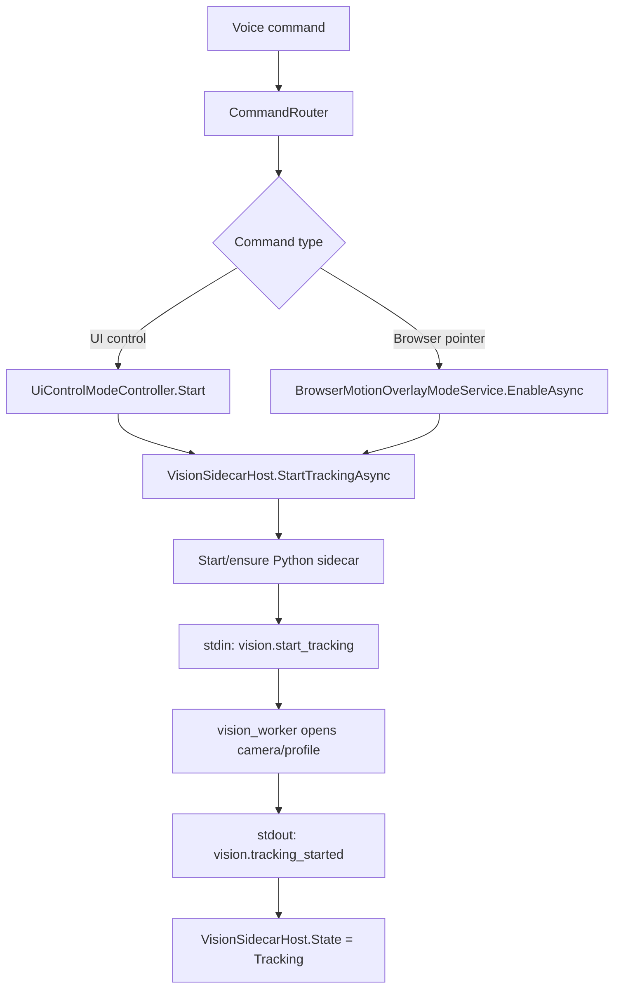
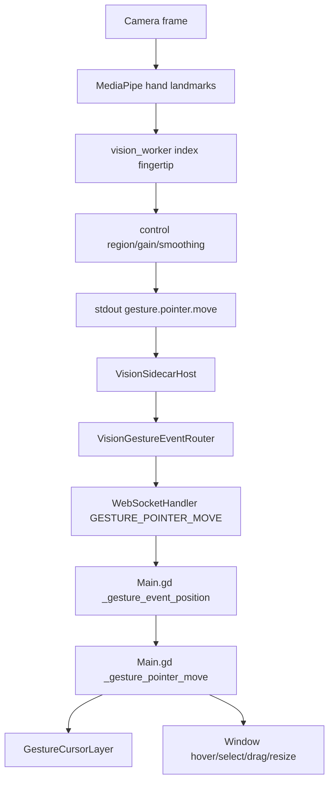
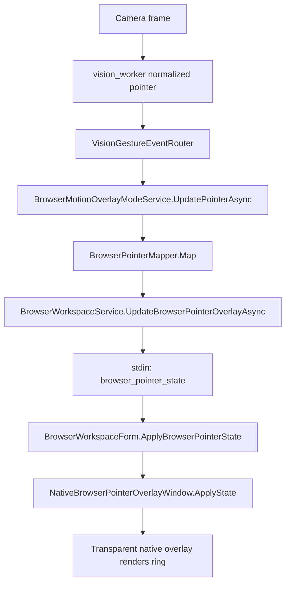
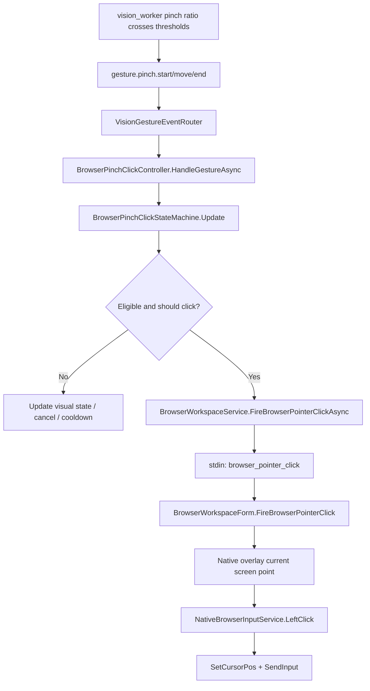
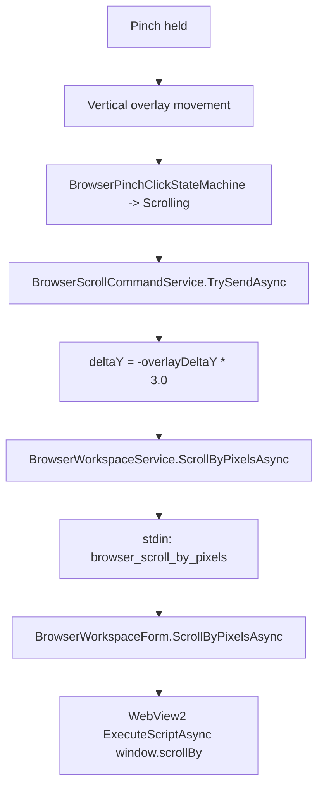

# Merlin Current Motion-Control Structure Report

## 1. Executive Summary

Merlin currently has one gesture engine and two separate motion-control consumers:

1. Hand tracking starts from backend voice/command routes in `Merlin.Backend/Services/CommandRouter.cs`. Dashboard UI control is started through `UiControlModeCommandMatcher`; browser pointer mode is started through `WebDestinationParser` and `BrowserMotionOverlayModeService`.
2. Camera and vision sidecar lifecycle are owned by `Merlin.Backend/Services/Vision/VisionSidecarHost.cs`. The sidecar process is `Merlin.Backend/VisionScripts/vision_worker.py`.
3. Hand coordinates are emitted by the Python worker as JSON lines on stdout, parsed by `VisionSidecarClient`, converted into `VisionGestureEvent`, and routed by `VisionGestureEventRouter`.
4. Dashboard pointer/hover/select/drag/resize/delete behavior lives mostly inside `Merlin.Frontend/Scripts/Main.gd`.
5. Low-level pinch detection lives inside `vision_worker.py`; browser-specific click interpretation lives in `BrowserPinchClickController` and `BrowserPinchClickStateMachine`.
6. Browser pointer overlay rendering lives in `Merlin.BrowserHost/NativeBrowserPointerOverlayWindow.cs`; backend state is owned by `BrowserMotionOverlayModeService`.
7. Browser pinch click lives in backend state machine code and BrowserHost native input injection. Backend decides "fire click"; BrowserHost decides the current screen coordinate from its native overlay.
8. Browser gesture scroll exists. It uses pinch-hold plus vertical movement in `BrowserPinchClickStateMachine`, sends deltas through `BrowserScrollCommandService`, and BrowserHost executes `window.scrollBy`.
9. Dashboard motion is enabled by UI control mode. Browser pointer motion is enabled by browser pointer mode. These are independent modes that can both consume the same sidecar events.
10. The main pain points are split ownership, duplicated coordinate mapping/smoothing, profile decisions embedded in command routes, and dashboard behavior buried in a large Godot script rather than a backend profile abstraction.
11. The code is usable as a foundation for profile-based motion control, but it is not yet profile-shaped. The likely clean path is to wrap the existing dashboard and browser behavior as profiles before moving logic.

## 2. Relevant Projects / Modules

| Area | Role |
| --- | --- |
| `Merlin.Backend` | Owns command routing, sidecar lifecycle, gesture routing, browser pointer state, browser pinch/click/scroll state, ActiveSurface state, config, and tests. |
| `Merlin.Backend/VisionScripts/vision_worker.py` | Python OpenCV/MediaPipe sidecar. Opens camera, selects capture profile, detects hands, emits normalized pointer/pinch events, handles pinch and motion-region calibration. |
| `Merlin.Frontend` | Godot dashboard UI. Receives WebSocket visual events, renders dashboard gesture cursor, maps normalized pointer into viewport pixels, handles dashboard hover/select/drag/resize/crumple/delete. |
| `Merlin.OrbLab` | Junction/parallel script area for some frontend scripts. Relevant because `Merlin.OrbLab/Scripts` mirrors many `Merlin.Frontend/Scripts` files in repo setup. |
| `Merlin.BrowserHost` | Native WinForms/WebView2 host. Receives stdin commands from backend, owns native browser pointer overlay, injects OS clicks, executes WebView2 scroll JavaScript. |
| `Merlin.Backend.Tests` | Backend test coverage for sidecar parsing, routing, browser pointer mode, browser pinch/click/scroll state, ActiveSurface, and command matching. |
| `Merlin.Backend/appsettings.json` and `Merlin.Backend/appsettings.Development.json` | Motion/camera/browser config: camera backend/profile, resolution/FPS, mirror, pinch thresholds, smoothing, gain, control region, browser workspace options. |

## 3. Current Motion-Control Entry Points

### Dashboard / Merlin UI Control

Code path:

| Utterance / pattern | File/class | Method | Service invoked | State changed | Surface affected |
| --- | --- | --- | --- | --- | --- |
| `start ui control`, `enable ui control`, `gesture mode`, `start gesture mode`, `edit the ui`, `open your eyes` | `Merlin.Backend/Services/UiControlModeController.cs`, `UiControlModeCommandMatcher` | `TryMatch` returns `Start` | `CommandRouter.RouteAsync` calls `UiControlModeController.Start()` and `IVisionSidecarHost.StartTrackingAsync()` | `UiControlModeController.State = Active`; sidecar tracking starts | Dashboard/Godot UI |
| `stop ui control`, `stop gesture mode`, `disable ui control`, `exit gesture mode`, `close ui control`, `done controlling`, `close your eyes` | same | `TryMatch` returns `Stop` | `CommandRouter.RouteAsync` calls `IVisionSidecarHost.StopTrackingAsync()` then `UiControlModeController.Stop()` | `UiControlModeController.State = Off`; sidecar tracking stops | Dashboard/Godot UI |
| `calibrate pinch`, `open your eyes calibrate pinch`, `eyes open calibrate pinch` | same | `TryMatch` returns `CalibratePinch` | `CommandRouter` starts UI control and tracking, returns speech; `WebSocketHandler.StartPinchCalibrationAfterSpeech` starts calibration after playback | UI mode active, tracking active, sidecar calibration active | Generic vision calibration |
| `calibrate motion region`, `calibrate control region`, `calibrate browser pointer region` | same | `TryMatch` returns `CalibrateMotionRegion` | `CommandRouter` starts UI control and tracking, `WebSocketHandler.StartMotionRegionCalibrationAfterSpeech` starts calibration after playback | UI mode active, tracking active, sidecar calibration active | Generic pointer region calibration |

`eyes open` / `eyes closed` as exact standalone commands do not currently exist as primary phrase entries. Existing supported forms are `open your eyes` and `close your eyes`. `eyes open calibrate pinch` exists as a calibration phrase, not a generic start command.

The frontend is notified through `WebSocketHandler.SendUiPanelEventIfNeededAsync`, which maps intents:

| Intent | Visual event |
| --- | --- |
| `ui_control_mode_start` | `UI_CONTROL_MODE_STARTED` |
| `ui_control_mode_stop` | `UI_CONTROL_MODE_STOPPED` |

`Merlin.Frontend/Scripts/Main.gd` handles these in `_handle_ui_control_visual_event`.

### Browser Pointer / Browser Motion

Code path:

| Utterance / pattern | File/class | Method | Service invoked | State changed | Surface affected |
| --- | --- | --- | --- | --- | --- |
| `start browser hand control`, `start browser pointer`, `show browser pointer`, `enable browser motion`, `enable browser pointer`, `turn on browser pointer`, `turn on browser motion`, `browser hand control`, `browser pointer` | `Merlin.Backend/Services/Web/WebDestinationParser.cs` | `TryParse` returns `WebDestinationAction.EnableBrowserMotionOverlay` | `CommandRouter.HandleWebDestinationCommandAsync` calls `BrowserMotionOverlayModeService.EnableAsync()` and `IVisionSidecarHost.StartTrackingAsync()` | Browser pointer mode active; sidecar tracking starts | BrowserWorkspace |
| `stop browser hand control`, `hide browser pointer`, `stop browser pointer`, `disable browser motion`, `disable browser pointer`, `turn off browser pointer`, `turn off browser motion` | same | returns `WebDestinationAction.DisableBrowserMotionOverlay` | `CommandRouter` calls `BrowserMotionOverlayModeService.DisableAsync("voice_command")`; stops sidecar only if dashboard UI control is not active | Browser pointer mode inactive; maybe sidecar stops | BrowserWorkspace |

The browser pointer commands are exact command-text sets after `SpokenCommandNormalizer` processing. They are separate from dashboard `open your eyes` / `close your eyes`.

### Live Utterance Gate

`Merlin.Backend/Services/LiveUtterance/LiveUtteranceGate.cs` checks `UiControlModeCommandMatcher.TryMatch(...)` and routes those as a positive `ui_control_mode_command`. It also consults `ActiveSurfaceService` for browser/media commands. This means motion start/stop commands are intended to be recognized during live speech interruption, but browser pointer commands still flow through the web destination parser.

## 4. Camera / Vision Sidecar Architecture

### Owner and process model

The sidecar owner is `Merlin.Backend/Services/Vision/VisionSidecarHost.cs`.

Key methods:

| Method | Responsibility |
| --- | --- |
| `WarmAsync` | Starts the Python sidecar without tracking when `Vision.WarmOnStartup` is enabled. |
| `StartTrackingAsync` | Ensures sidecar process is running and sends `vision.start_tracking`. |
| `StopTrackingAsync` | Sends `vision.stop_tracking`. |
| `CalibratePinchAsync` | Sends `vision.calibrate_pinch`, waits for `vision.pinch_calibration_completed`. |
| `CalibrateMotionRegionAsync` | Sends `vision.calibrate_motion_region`, waits for `vision.motion_region_calibration_completed`. |
| `ShutdownAsync` | Sends shutdown or kills process. |
| `HandleOutputLineAsync` | Parses sidecar stdout and routes status/gesture/calibration messages. |

Transport is stdin/stdout JSON. It is not WebSocket, HTTP, or named pipe. `VisionSidecarHost.SendCommandLockedAsync` serializes with `VisionSidecarClient.SerializeCommand` and writes one JSON object per line to process stdin. `vision_worker.py` reads `sys.stdin` line by line in `VisionWorker.run`.

### Start command payload

`VisionSidecarHost.StartTrackingAsync` sends:

```text
type = vision.start_tracking
cameraName = VisionOptions.PreferredCameraName
backend = VisionOptions.Backend
captureProfile = VisionOptions.CaptureProfile
cameraIndex = VisionOptions.CameraIndex
modelAssetPath
width, height, fps
mirrorPreview, debugPreview
emitRateHz, maxHands
primaryLostGraceMs, primarySwitchDistanceThreshold
pinchStartRatio, pinchHoldRatio, pinchReleaseRatio, pinchDebounceMs
pinchCalibrationPath, motionRegionCalibrationPath
smoothingAlpha, pointerDeadzone
pointerGainX, pointerGainY
controlRegionLeft, controlRegionTop, controlRegionRight, controlRegionBottom
```

### Camera profile selection

`Merlin.Backend/VisionScripts/vision_worker.py` has adaptive capture-profile selection.

Relevant functions:

| Function | Responsibility |
| --- | --- |
| `open_configured_camera` | Resolves preferred camera name to index if configured; falls back to camera index 0 if needed. |
| `select_camera_backend` | Builds candidate profiles, benchmarks them, chooses a profile, reopens selected profile if needed. |
| `capture_profile_candidates` | Returns candidate profiles for `Auto`, `MSMF`, `DSHOW`, `DEFAULT`, or manual profile. |
| `benchmark_capture_profile` | Measures open success, first frame, resolution, FPS, fourcc, sustained reads, black frames, failed reads. |
| `choose_benchmark_result` | Selects based on exact resolution, measured FPS, MJPG preference, avg read ms, startup time. |
| `open_capture_for_profile` | Opens `DSHOW_MJPG_CONSTRUCTOR` using OpenCV constructor params. |
| `configure_capture_for_profile` | Sets width/height/FPS/fourcc for non-constructor profiles. |

Candidate profiles currently include:

```text
DSHOW_MJPG_CONSTRUCTOR
DSHOW_MJPG_SET_BEFORE_AFTER
DSHOW_DEFAULT
MSMF_DEFAULT
DEFAULT
```

`DSHOW_MJPG_CONSTRUCTOR` is still used and is preferred when it benchmarks well. Its OpenCV path is:

```python
cv2.VideoCapture(source, cv2.CAP_DSHOW, [
    cv2.CAP_PROP_FOURCC, cv2.VideoWriter_fourcc(*"MJPG"),
    cv2.CAP_PROP_FRAME_WIDTH, width,
    cv2.CAP_PROP_FRAME_HEIGHT, height,
    cv2.CAP_PROP_FPS, fps,
])
```

### Data flowing out of sidecar

The sidecar emits:

| Type | Payload |
| --- | --- |
| `vision.ready` | `version` |
| `vision.tracking_started` | `cameraName`, `actualWidth`, `actualHeight`, `actualFps` |
| `vision.tracking_stopped` | no motion payload |
| `vision.error` | `error`, `message`, `code` |
| `gesture.pointer.move` | `pointerId`, `x`, `y`, `confidence`, `source`, sidecar also writes `handedness` but backend model does not currently expose it |
| `gesture.pinch.start` | `pointerId`, `x`, `y`, `confidence`, `source`, sidecar also writes `handedness` |
| `gesture.pinch.move` | `pointerId`, `x`, `y`, `confidence`, `source`, sidecar also writes `handedness` |
| `gesture.pinch.end` | `pointerId`, `source` |
| `vision.pinch_calibration_started/completed` | calibration status, thresholds, sample counts, path |
| `vision.motion_region_calibration_started/completed` | calibration status, control-region values, sample counts, path |

No full landmark list crosses into C# today. The backend receives only normalized pointer coordinates, pinch event type, pointer id, confidence, and source.

### Multiple consumers

`VisionGestureEventRouter.RouteAsync` can feed both:

1. Browser pointer/click/scroll services when browser pointer mode is active.
2. WebSocket frontend gesture events whenever UI control mode is active, or whenever browser pointer mode is active.

Because the router forwards to `GestureEventForwarded` after browser handling, frontend subscribers can still receive gesture events while browser pointer mode is active. Godot then ignores them unless `_ui_control_mode_active` is true.

## 5. Hand Tracking Data Model

### Backend message models

`Merlin.Backend/Services/Vision/VisionSidecarMessage.cs`

Important properties:

| Property | Meaning |
| --- | --- |
| `Type` | Sidecar message type. |
| `CameraName`, `ActualWidth`, `ActualHeight`, `ActualFps` | Tracking startup metadata. |
| `PointerId` | Logical pointer id, usually `primary` or `secondary`. |
| `X`, `Y` | Normalized pointer coordinates after sidecar mapping, gain, control region, smoothing. |
| `Confidence` | Handedness/model confidence from MediaPipe output, defaulted by worker to 0.8 when unavailable. |
| `Source` | Usually `webcam`. |
| `PinchStartRatio`, `PinchHoldRatio`, `PinchReleaseRatio` | Pinch calibration output. |
| `ControlRegionLeft/Top/Right/Bottom` | Motion-region calibration output. |

`Merlin.Backend/Services/Vision/VisionGestureEvent.cs`

```text
Type
PointerId = "primary" default
X = double?
Y = double?
Confidence
Source = "webcam" default
```

This is the main backend gesture event model used by router/browser/frontend.

### Python-side internal state

`Merlin.Backend/VisionScripts/vision_worker.py`, `VisionWorker.__init__`:

| Field | Meaning |
| --- | --- |
| `pinched_by_pointer` | Tracks whether a logical pointer is currently pinched. |
| `pinch_candidate_since_by_pointer` | Debounce start time before emitting `gesture.pinch.start`. |
| `smoothed_by_pointer` | Last smoothed normalized coordinate by pointer. |
| `last_emit_by_pointer` | Emit throttling by pointer id. |
| `pinch_calibration` | Active pinch calibration session state. |
| `motion_region_calibration` | Active motion region calibration session state. |

Logical hands:

| Pointer | Current behavior |
| --- | --- |
| `primary` | Selected by `select_primary_candidate` / previous primary tracking. |
| `secondary` | Selected by `select_secondary_candidate`. |

The sidecar can process up to `VisionOptions.MaxHands`, default 2.

### Coordinate systems

| Coordinate system | Owner | Notes |
| --- | --- | --- |
| Camera/MediaPipe landmark coordinates | `vision_worker.py` | Normalized landmark values from MediaPipe, e.g. index fingertip landmark 8. |
| Sidecar normalized pointer coordinates | `vision_worker.py` | Index tip x/y after optional mirroring, control region, gain, smoothing, deadzone. |
| Backend gesture event coordinates | `VisionGestureEvent.X/Y` | Same normalized values from sidecar. |
| Godot dashboard viewport coordinates | `Main.gd._gesture_event_position` | `x * viewport_size.x`, `y * viewport_size.y`. |
| Browser overlay-local coordinates | `BrowserPointerMapper` | `NormalizedX * BrowserWorkspaceBounds.Width`, `NormalizedY * Height`, then backend smoothing. |
| BrowserHost screen coordinates | `NativeBrowserPointerOverlayWindow.TryGetCurrentScreenClickPoint` | `Bounds.X + OverlayX`, `Bounds.Y + OverlayY`. |

The most important current ambiguity is that pointer mapping happens twice for browser mode: sidecar-level mapping/smoothing/gain and backend-level browser overlay smoothing. Dashboard mode only uses sidecar mapping plus Godot viewport conversion.

## 6. Coordinate Mapping Pipeline

### Dashboard / Merlin UI pointer flow

```text
MediaPipe index fingertip landmark
-> vision_worker.pointer_position
-> vision_worker.map_pointer_position
-> vision_worker.smooth_position
-> gesture.pointer.move JSON
-> VisionSidecarHost
-> VisionGestureEventRouter
-> WebSocketHandler.SendVisionGestureEventAsync
-> MerlinWebSocketClient / Main.gd visual event
-> Main.gd._gesture_event_position
-> Main.gd._gesture_pointer_move
-> GestureCursor PanelContainer, window manager hit testing
```

Mapping details:

| Step | Location | Behavior |
| --- | --- | --- |
| Mirroring | `vision_worker.capture_loop` | If `mirrorPreview` true, OpenCV frame is flipped before MediaPipe. |
| Raw pointer | `vision_worker.pointer_position` | Uses index fingertip landmark 8. |
| Control region | `vision_worker.map_pointer_position` | Crops/remaps configured region to full 0..1 pointer range. |
| Gain | `vision_worker.map_pointer_position` | `0.5 + (region - 0.5) * pointerGainX/Y`, clamped 0..1. |
| Smoothing/deadzone | `vision_worker.smooth_position` | Exponential smoothing and minimum movement deadzone. |
| Godot pixels | `Main.gd._gesture_event_position` | Multiplies by current viewport size. |
| Dashboard hit testing | `Main.gd._surface_at_gesture_position` | Uses `_window_manager.get_topmost_window_at(position, accepts_gesture_grab)`. |

DPI/multi-monitor: dashboard motion is viewport-local. The report did not find explicit DPI/multi-monitor mapping for dashboard gestures in the inspected code.

### BrowserWorkspace native pointer overlay flow

```text
MediaPipe index fingertip landmark
-> sidecar normalized pointer x/y after sidecar mapping
-> VisionGestureEventRouter
-> BrowserMotionOverlayModeService.UpdatePointerAsync
-> BrowserPointerMapper.Map
-> BrowserWorkspaceService.UpdateBrowserPointerOverlayAsync
-> stdin command browser_pointer_state
-> BrowserWorkspaceForm.ApplyBrowserPointerState
-> NativeBrowserPointerOverlayWindow.ApplyState
```

Mapping details:

| Step | Location | Behavior |
| --- | --- | --- |
| Browser bounds | `BrowserWorkspaceService.CurrentBounds` | Comes from BrowserHost state output and is included in `BrowserWorkspaceStateChanged`. |
| Backend overlay mapping | `BrowserPointerMapper.Map` | Converts normalized x/y into overlay-local x/y using bounds width/height. |
| Backend smoothing | `BrowserPointerMapper.Map` | Uses constant `Smoothing = 0.32`. |
| Reliability gate | `BrowserPointerMapper.Map` | Requires x/y present, non-minimized bounds, and confidence >= `DefaultMinimumReliableConfidence` 0.45. |
| Overlay render | `NativeBrowserPointerOverlayWindow.OnPaint` | Draws ring at overlay-local x/y in a transparent, click-through topmost WinForms window. |
| Click coordinate | `NativeBrowserPointerOverlayWindow.TryGetCurrentScreenClickPoint` | Converts overlay-local coordinate to screen coordinate. |

DPI/multi-monitor: BrowserHost uses native screen coordinates from `GetBrowserSurfaceScreenBounds()` and WinForms `Bounds`. The backend stores bounds as integers. There is no explicit DPI-normalization layer in the motion services; correctness depends on BrowserHost returning and consuming coordinates in the same Windows coordinate space.

### Duplicated mapping

Current duplication:

| Mapping logic | Dashboard | Browser |
| --- | --- | --- |
| Sidecar control region/gain/smoothing | Yes | Yes |
| Consumer-level smoothing | No explicit smoothing beyond sidecar | `BrowserPointerMapper` smoothing |
| Consumer-level confidence gating | Mostly frontend mode gate only | `BrowserPointerMapper` and `BrowserPinchClickController` |
| Pixel conversion | Godot viewport | Browser bounds |

For profiles, sidecar mapping should remain generic "usable normalized pointer", while per-profile mapping should own target-surface-specific transforms and reliability thresholds.

## 7. Smoothing / Stabilization / Confidence

| Mechanism | File/class/method | Values | Applies to | Configurable |
| --- | --- | --- | --- | --- |
| Sidecar smoothing | `vision_worker.py`, `smooth_position` | `smoothingAlpha`, default 0.25 | All sidecar pointer events | Yes, `VisionOptions.SmoothingAlpha` |
| Sidecar deadzone | `vision_worker.py`, `smooth_position` | `pointerDeadzone`, default 0.003 | All sidecar pointer events | Yes |
| Sidecar emit throttle | `vision_worker.py`, `emit_pointer` | `emitRateHz`, default 30 | All pointer events | Yes |
| Primary hand lost grace | `vision_worker.py`, `handle_primary_missing` | `primaryLostGraceMs`, default 600 | Primary/secondary assignment | Yes |
| Primary switch threshold | `vision_worker.py`, hand assignment | `primarySwitchDistanceThreshold`, default 0.18 | Primary hand continuity | Yes |
| Browser pointer smoothing | `BrowserPointerMapper.Map` | `Smoothing = 0.32` | Browser overlay only | No, hardcoded |
| Browser reliability threshold | `BrowserPointerMapper.DefaultMinimumReliableConfidence` | 0.45 | Browser overlay/click | No, hardcoded |
| Browser pinch arm duration | `BrowserPinchClickStateMachine` | 120 ms default | Browser click | Constructor, not app config |
| Browser scroll hold duration | `BrowserPinchClickStateMachine` | 250 ms default | Browser scroll | Constructor, not app config |
| Browser scroll movement threshold | `BrowserPinchClickStateMachine` | 28 px default | Browser scroll | Constructor, not app config |
| Browser click/scroll cooldown | `BrowserPinchClickStateMachine` | 320 ms default | Browser click/scroll | Constructor, not app config |
| Browser scroll throttle | `BrowserScrollCommandService` | 25 ms default | Browser scroll | Constructor, not app config |
| Browser scroll scale | `BrowserScrollCommandService` | 3.0 page px per overlay px | Browser scroll | Constructor, not app config |
| Dashboard tap duration | `Main.gd` | `PINCH_TAP_MAX_DURATION_MS = 220` | Dashboard select | Hardcoded const |
| Dashboard tap movement | `Main.gd` | `PINCH_TAP_MAX_MOVEMENT_PX = 18.0` | Dashboard select | Hardcoded const |
| Dashboard hold-to-grab | `Main.gd` | `PINCH_HOLD_TO_GRAB_MS = 260` | Dashboard drag | Hardcoded const |
| Dashboard drag movement | `Main.gd` | `DRAG_START_MOVEMENT_PX = 20.0` | Dashboard drag | Hardcoded const |
| Dashboard resize sensitivity | `Main.gd` | `GESTURE_RESIZE_SENSITIVITY = 0.5` | Dashboard resize | Hardcoded const |

Smoothing is not shared. Sidecar smoothing affects both dashboard and browser; browser then adds an additional smoothing layer. Dashboard behavior has additional gesture thresholds in Godot.

## 8. Current Dashboard / Merlin UI Motion Behavior

Dashboard motion lives in `Merlin.Frontend/Scripts/Main.gd`.

Main state fields:

```gdscript
_ui_control_mode_active
_gesture_cursor_layer
_gesture_cursor
_gesture_visual_pointer_id
_gesture_pointer_positions
_gesture_pointer_pinched
_gesture_pending_pinches
_gesture_pointer_history
_gesture_grabs
_gesture_hover_surface_id
_gesture_hover_surface_by_pointer
_gesture_resize_state
_selected_surface_id
_crumple_state
```

### Rendering

| Function | Role |
| --- | --- |
| `_setup_gesture_cursor` | Creates `CanvasLayer` named `GestureCursorLayer`, layer 128. |
| `_ensure_gesture_cursor` | Creates one `PanelContainer` cursor, size `GESTURE_CURSOR_SIZE = 34`. |
| `_set_gesture_cursor_position` | Places cursor at pointer position minus half cursor size. |
| `_set_gesture_cursor_visible` | Shows/hides cursor. |
| `_set_gesture_cursor_pinched` | Changes cursor style for pinched/unpinched. |
| `_set_gesture_cursor_size_multiplier` | Resizes visual cursor during resize gesture. |

The dashboard pointer is not a native OS pointer. It is a Godot `PanelContainer`.

### Event handling

Backend WebSocket visual events:

| Backend event | Godot handler |
| --- | --- |
| `GESTURE_POINTER_MOVE` | `_gesture_pointer_move(pointer_id, _gesture_event_position(event))` |
| `GESTURE_PINCH_START` | move pointer, then `_gesture_pinch_start(pointer_id)` |
| `GESTURE_PINCH_MOVE` | `_gesture_pointer_move(...)` |
| `GESTURE_PINCH_END` | `_gesture_pinch_end(pointer_id)` |

`_gesture_event_position` converts normalized x/y to viewport pixels.

Mode gate: `_gesture_pointer_move` and `_gesture_pinch_start` ignore events unless `_ui_control_mode_active` is true. `_gesture_pinch_end` does not begin with the same explicit active check, but it operates on current dictionaries and is normally harmless when no state exists.

### Hover/select/drag/resize

| Behavior | Functions |
| --- | --- |
| Hover | `_update_gesture_hover`, `_surface_at_gesture_position`, `_combined_gesture_hover_surface`, `_apply_chatlog_gesture_state` |
| Select/tap | `_gesture_pinch_start`, `_finish_pending_pinch`, `_select_surface` |
| Drag/move | `_maybe_promote_pending_pinch`, `_promote_pending_pinch_to_grab`, `_move_gesture_grab` |
| Two-hand resize | `_try_start_gesture_resize`, `_gesture_resize_axes_for_delta`, `_update_gesture_resize`, `_finish_gesture_resize` |
| Crumple/delete/dismiss | `_update_selected_ball_forming`, `_try_start_crumple_candidate`, `_update_crumple`, `_commit_crumple_dismiss` |

Window support lives in:

| File | Role |
| --- | --- |
| `Merlin.Frontend/Scripts/UI/Windows/MerlinWindow.gd` | Visual state fields `_gesture_hovered`, `_gesture_selected`, `_gesture_grabbed`, `_gesture_resizing`, `_gesture_crumpling`; `set_gesture_visual_state`. |
| `Merlin.Frontend/Scripts/UI/Windows/MerlinWindowCapabilities.gd` | Capabilities `accepts_gesture_grab`, `accepts_gesture_resize`, `accepts_gesture_dismiss`. |
| `Merlin.Frontend/Scripts/UI/Windows/MerlinWindowConstants.gd` | Capability constants and layer group names. |
| `Merlin.Frontend/Scripts/UI/Windows/CrumpleSheetProxy.gd` | Visual crumple/throw proxy. |

The dashboard behavior is active only after `UI_CONTROL_MODE_STARTED` and stops on `UI_CONTROL_MODE_STOPPED`. It avoids voice/TTS/STT interference only indirectly: it is rendered as UI and does not own microphone/listening state. Voice ownership lives elsewhere.

## 9. Current BrowserWorkspace Motion Behavior

### Backend services

| File/class | Responsibility |
| --- | --- |
| `BrowserMotionOverlayModeService` | Owns browser pointer active/inactive state, current `BrowserPointerRenderState`, browser bounds reactions, backend pointer updates. |
| `BrowserPointerMapper` | Converts normalized gesture coordinates to browser overlay-local pixels and applies browser-specific smoothing/confidence. |
| `BrowserPointerRenderState` | Backend render-state record sent to BrowserHost. |
| `BrowserPinchClickController` | Consumes pinch events, checks eligibility, updates visual state, sends click or scroll commands. |
| `BrowserPinchClickStateMachine` | Generic-ish browser pinch phases for candidate/armed/click/scroll/cooldown. |
| `BrowserScrollCommandService` | Converts overlay delta into page scroll pixels and throttles `ScrollByPixelsAsync`. |
| `BrowserWorkspaceService` | Sends `browser_pointer_state`, `browser_pointer_click`, and `browser_scroll_by_pixels` commands to BrowserHost. |

### BrowserHost classes

| File/class | Responsibility |
| --- | --- |
| `Merlin.BrowserHost/BrowserWorkspaceForm.cs` | Receives stdin commands, applies pointer state, fires pointer click, executes scroll JS. |
| `Merlin.BrowserHost/BrowserWorkspaceCommand.cs` | Command DTO with pointer fields and `deltaY`. |
| `Merlin.BrowserHost/NativeBrowserPointerOverlayWindow.cs` | Transparent, click-through, topmost pointer overlay window. |
| `Merlin.BrowserHost/NativeBrowserInputService.cs` | Uses `SetCursorPos` and `SendInput` for native left click. |

### Message types

Backend -> BrowserHost:

| Type | Writer | Reader | Meaning |
| --- | --- | --- | --- |
| `browser_pointer_state` | `BrowserWorkspaceService.UpdateBrowserPointerOverlayAsync` | `BrowserWorkspaceForm.ApplyBrowserPointerState` | Show/update/hide pointer overlay. |
| `browser_pointer_click` | `BrowserWorkspaceService.FireBrowserPointerClickAsync` | `BrowserWorkspaceForm.FireBrowserPointerClick` | Click current overlay pointer position. |
| `browser_scroll_by_pixels` | `BrowserWorkspaceService.ScrollByPixelsAsync` | `BrowserWorkspaceForm.ScrollByPixelsAsync` | Execute `window.scrollBy({ top: deltaY })`. |

### Overlay behavior

`NativeBrowserPointerOverlayWindow`:

```text
FormBorderStyle = None
ShowInTaskbar = false
BackColor = TransparencyKey = magenta
TopMost = true
DoubleBuffered = true
ShowWithoutActivation = true
WS_EX_LAYERED | WS_EX_TRANSPARENT | WS_EX_TOOLWINDOW | WS_EX_NOACTIVATE
WM_NCHITTEST -> HTTRANSPARENT
```

The overlay hides if pointer state inactive or bounds invalid. It draws different ring colors/radii for `normal`, `pinch_candidate`, `pinch_armed`, `click_sent`, `scroll_candidate`, `scrolling`, `cooldown`, and `low_confidence`.

Low confidence does not hide the pointer if hand is in frame, but it changes alpha and visual state. Clicks are blocked when tracking is not reliable.

Known limitation from code: `BrowserMotionOverlayModeService.DisableAsync` sends inactive state through `BrowserWorkspaceService.UpdateBrowserPointerOverlayAsync`. That method quietly returns if BrowserHost is inactive. This prevents crashes but means BrowserHost cleanup relies on process close when host is already gone.

## 10. Pinch Click Architecture

Phase 3 exists.

### State machine

File: `Merlin.Backend/Services/BrowserWorkspace/Motion/BrowserPinchClickStateMachine.cs`

Actual phases:

```text
OpenHand
PinchCandidate
PinchArmed
ClickSent
PinchHeld
ScrollCandidate
Scrolling
Released
Cooldown
LowConfidence
```

Not all enum values are currently used equally. `PinchHeld`, `ScrollCandidate`, and `Released` are defined but the active transition path mainly uses `OpenHand`, `PinchCandidate`, `PinchArmed`, `ClickSent`, `Scrolling`, `Cooldown`, and `LowConfidence`.

Default thresholds:

| Threshold | Value |
| --- | --- |
| Click arm duration | 120 ms |
| Scroll hold duration | 250 ms |
| Scroll movement threshold | 28 overlay px |
| Cooldown | 320 ms |

One-click-per-pinch behavior: click is emitted on release if the pinch was down, not scrolling, candidate duration >= arm duration, and cooldown has passed. After click, `_cooldownUntil` is set.

Low-confidence blocking:

| File/method | Behavior |
| --- | --- |
| `BrowserPinchClickController.GetEligibility` | Blocks if browser inactive, overlay inactive, bounds unavailable/minimized, hand lost, confidence < 0.45, or outside bounds. |
| `BrowserPinchClickController.OnBrowserPointerStateChangedAsync` | Cancels state machine and scroll state on low confidence, inactive overlay, hand lost, or minimized. |

Hand-lost cancellation: if pointer render state has `IsHandInFrame = false` or not reliable, the controller cancels the state machine. If currently scrolling, logs `BrowserScrollGestureCancelled`.

Click path:

```text
vision_worker emits gesture.pinch.start/move/end
-> VisionGestureEventRouter
-> BrowserPinchClickController.HandleGestureAsync
-> BrowserPinchClickStateMachine.Update
-> BrowserWorkspaceService.FireBrowserPointerClickAsync
-> BrowserHost browser_pointer_click
-> NativeBrowserPointerOverlayWindow.TryGetCurrentScreenClickPoint
-> NativeBrowserInputService.LeftClick
-> SetCursorPos + SendInput
```

Tests: `Merlin.Backend.Tests/BrowserPinchClickControllerTests.cs` covers state transitions, cooldown, low confidence, click dispatch, scroll gesture behavior, and hand lost cancellation.

## 11. Scroll Gesture Architecture

Phase 4 exists.

Gesture: pinch-hold plus vertical movement.

Implementation:

| Class | Role |
| --- | --- |
| `BrowserPinchClickStateMachine` | Detects transition to `Scrolling` after held long enough and movement threshold exceeded. |
| `BrowserPinchClickController` | When state is `Scrolling`, calls `BrowserScrollCommandService.TrySendAsync`. |
| `BrowserScrollCommandService` | Accumulates overlay delta, throttles sends, maps hand movement to page scroll pixels. |
| `BrowserWorkspaceService.ScrollByPixelsAsync` | Sends `browser_scroll_by_pixels`. |
| `BrowserWorkspaceForm.ScrollByPixelsAsync` | Executes `window.scrollBy({ top: deltaY, left: 0, behavior: 'auto' })`. |

Thresholds:

| Value | Default |
| --- | --- |
| Hold threshold | 250 ms |
| Vertical movement threshold | 28 overlay px |
| Scroll scale | 3.0 page px per overlay px |
| Throttle interval | 25 ms |
| Cooldown after scroll release | 320 ms |

Direction mapping: `BrowserScrollCommandService` comments it as touch-style mapping: hand up (negative overlay delta) scrolls page down. Code computes:

```csharp
deltaY = Round(-accumulatedOverlayDeltaY * pixelsPerOverlayPixel)
```

Accidental click prevention: when `_scrolling` is true and pinch is released, state becomes `Cooldown`, not `ClickSent`.

Tests: `BrowserPinchClickControllerTests` covers scroll entering, scroll command sends, no click after scroll, low-confidence cancellation, and hand-lost cancellation. There is no BrowserHost UI test for the actual WebView2 script execution.

## 12. Current Safety Boundaries

| Gate | File/method | Protects | Gaps |
| --- | --- | --- | --- |
| UI/browser mode gate | `VisionGestureEventRouter.RouteAsync` | Ignores gestures when both UI control and browser pointer are inactive. | If browser pointer is active, events are still forwarded to frontend; Godot ignores if UI control off. |
| Sidecar stop | `CommandRouter` stop cases | Stops camera when stopping UI control or browser pointer where appropriate. | Two modes can share tracking; stopping one mode must consider the other. |
| Browser active check | `BrowserMotionOverlayModeService.EnableAsync` | Rejects pointer start if browser not open/unavailable. | Does not use ActiveSurface directly. |
| Browser bounds/minimized check | `BrowserPointerMapper`, `BrowserPinchClickController`, BrowserHost | Prevents unreliable overlay/click when minimized or invalid. | DPI/multi-monitor assumptions are implicit. |
| Confidence gate | `BrowserPointerMapper` and `BrowserPinchClickController` | Blocks browser click/scroll below 0.45. | Dashboard has no equivalent backend confidence gate beyond sidecar event content. |
| Hand-in-frame gate | Browser pointer state and click controller | Blocks click when x/y missing or no hand. | `gesture.pinch.end` has no coordinate by design. |
| Click coordinate gate | `NativeBrowserPointerOverlayWindow.TryGetCurrentScreenClickPoint` | BrowserHost refuses click if pointer unavailable. | OS cursor moves to target for click; page-specific safety not involved. |
| Pinch cooldown | `BrowserPinchClickStateMachine` | Prevents repeated click/scroll from one pinch. | Threshold hardcoded, not per profile. |
| Scroll state cooldown | `BrowserPinchClickStateMachine` | Prevents click on scroll release. | Scroll and click currently share one browser state machine. |
| Browser page safety | `BrowserPageSafetyGuard` | Applies to page-control click-by-text/common actions. | Does not guard raw motion pointer clicks. |
| Confirmation flow | `IConfirmationService`, page-control path | Applies to selected browser page actions. | Does not apply to raw motion click. |

Can a gesture ever click/scroll when motion mode should be inactive?

Based on code: a browser gesture click/scroll should not fire unless `BrowserMotionOverlayModeService.IsActive` is true, because `VisionGestureEventRouter` only calls `BrowserPinchClickController` in that case. Dashboard gestures should not affect UI unless `_ui_control_mode_active` is true. The risky gap is not an obvious active-mode bypass, but ownership ambiguity when both modes are active or when BrowserHost closes while mode state is being reset.

## 13. State Ownership Map

| State | Owner | Readers | Writers | Threading/lifetime | Reset conditions |
| --- | --- | --- | --- | --- | --- |
| Camera process running | `VisionSidecarHost._process` | `VisionSidecarHost` | `WarmAsync`, `StartTrackingAsync`, process exit, `ShutdownAsync` | Backend singleton, semaphore `_gate` | Shutdown, process exit, fault |
| Tracking active | `VisionSidecarHost.State` plus sidecar capture loop | `CommandRouter`, logs, health | `HandleOutputLineAsync`, process exit, start/stop | Backend singleton plus sidecar thread | `vision.tracking_stopped`, sidecar exit |
| Dashboard motion enabled | `UiControlModeController.State` and frontend `_ui_control_mode_active` | `VisionGestureEventRouter`, `CommandRouter`, `Main.gd` | Backend command route; frontend visual events | Backend singleton lock; Godot main thread | Stop command, visual event |
| Browser pointer overlay active | `BrowserMotionOverlayModeService._state.IsActive` | Router, click controller, command router | `EnableAsync`, `DisableAsync`, workspace state events | Backend singleton lock `_gate` | Disable command, browser unavailable/close |
| Pinch click state | `BrowserPinchClickStateMachine` | `BrowserPinchClickController` | `HandleGestureAsync`, `ResetAsync`, pointer/workspace events | Backend singleton object | release, cooldown, cancel, workspace unavailable |
| Scroll gesture active | `BrowserPinchClickStateMachine._scrolling` | `BrowserPinchClickController` | state machine update/cancel | Backend singleton object | release, low confidence, hand lost |
| Current browser pointer position | `BrowserMotionOverlayModeService._state`, `NativeBrowserPointerOverlayWindow._state` | Click controller, BrowserHost | pointer updates from sidecar | Backend lock plus WinForms UI thread | disable, browser close, minimized, low confidence |
| Last reliable browser pointer | `BrowserPointerMapper._lastOverlayX/Y` | mapper only | mapper | Backend singleton | `BrowserPointerMapper.Reset` on enable/disable |
| Dashboard pointer positions | `Main.gd._gesture_pointer_positions` | Dashboard gesture functions | WebSocket/synthetic event handlers | Godot main thread | UI mode stop |
| Hand confidence | Sidecar event payload, `VisionGestureEvent.Confidence`, browser render state | Router/browser mapper/click | sidecar | Per event | next event |
| Pinch detection | `vision_worker.pinched_by_pointer` | sidecar only | sidecar update/release functions | Sidecar thread | stop tracking, hand missing, release all |
| Browser host bounds | `BrowserWorkspaceService._currentBounds` | browser motion overlay, ActiveSurface metadata, WebSocket | BrowserHost output handling | Backend singleton/semaphore | host close/exited |
| Active surface | `ActiveSurfaceService._current` | `CommandRouter`, `LiveUtteranceGate`, browser command normalizer | BrowserWorkspaceService, reset default | Backend singleton lock | browser open/close/navigation/focus; reset |

Duplicated/unclear ownership:

- Dashboard and browser both own their own pointer state.
- Sidecar owns generic pinch state; browser also owns pinch-click state; Godot owns dashboard pinch tap/drag state.
- ActiveSurface knows browser/dashboard context, but motion mode selection does not yet consume it.

## 14. Event / Message Flow Diagrams

### Diagram A - Tracking startup



### Diagram B - Dashboard pointer flow



### Diagram C - Browser pointer flow



### Diagram D - Browser pinch click flow



### Diagram E - Browser scroll flow



## 15. Current Tests

| Test file | Coverage | Missing |
| --- | --- | --- |
| `Merlin.Backend.Tests/VisionSidecarClientTests.cs` | Parses gesture, pinch calibration, motion region calibration, errors; source checks for adaptive capture profile, pointer mapping, calibration support. | Does not execute real sidecar/camera. |
| `Merlin.Backend.Tests/VisionGestureEventRouterTests.cs` | Ignores when modes off; forwards when UI active; multiple pointer ids; forwards when browser pointer mode active without UI control. | Does not test combined UI+browser conflict semantics deeply. |
| `Merlin.Backend.Tests/BrowserMotionOverlayModeServiceTests.cs` | Enable rejection/start, workspace closed disables overlay, minimized/restored behavior, pointer mapping updates. | Does not test BrowserHost native overlay. |
| `Merlin.Backend.Tests/BrowserPinchClickControllerTests.cs` | State machine click/cooldown, low confidence, browser click dispatch, scroll start/send/cancel. | Does not test OS input or WebView2 execution. |
| `Merlin.Backend.Tests/CommandRouterTests.cs` | Browser pointer start/stop commands, browser scroll commands, active surface browser media routing, UI control start/stop/calibration routing. | Does not cover full sidecar process or Godot visual event reception. |
| `Merlin.Backend.Tests/SpokenCommandNormalizerTests.cs` | Natural UI-control command phrases including `open your eyes`, `close your eyes`, calibration phrases, polite wrappers. | No profile-mode phrases like exact `eyes open` / `eyes closed` as standalone. |
| `Merlin.Backend.Tests/ActiveSurfaceServiceTests.cs` | Default dashboard, browser update, reset to dashboard, confidence clamping. | Does not test profile selection because no profile layer exists. |
| `Merlin.Backend.Tests/BrowserMediaCommandNormalizerTests.cs` | ActiveSurface-based pause/play/fullscreen/skip-ad command matching. | Site-specific controls are intentionally limited. |

No automated test was found for the Godot dashboard gesture implementation in `Main.gd` or for BrowserHost overlay rendering/click-through behavior.

Validation run during this report task:

| Command | Result | Notes |
| --- | --- | --- |
| `dotnet build Merlin.Backend\Merlin.Backend.csproj --no-restore -p:UseSharedCompilation=false` | Passed | SDK printed preview-version informational `NETSDK1057`; build had 0 warnings and 0 errors. |
| `dotnet test Merlin.Backend.Tests\Merlin.Backend.Tests.csproj --no-restore --filter "Vision|BrowserMotion|BrowserPinch|BrowserMedia|ActiveSurface|UiControl|CommandRouter" -p:UseSharedCompilation=false` | Passed | 389 passed, 0 failed, 0 skipped. |

## 16. Current Configuration

### Vision config

`Merlin.Backend/Configuration/VisionOptions.cs` defines:

| Option | Default in class | Current appsettings observed |
| --- | --- | --- |
| `Enabled` | true | true |
| `WarmOnStartup` | false | false |
| `PythonExecutable` | `python` | Anaconda `merlin-vision` python path |
| `WorkerScriptPath` | `VisionScripts/vision_worker.py` | same |
| `ModelAssetPath` | `VisionModels/hand_landmarker.task` | same |
| `PreferredCameraName` | empty | empty |
| `Backend` | `Auto` | `Auto` |
| `CaptureProfile` | `Auto` | `Auto` |
| `CameraIndex` | 0 | 0 |
| `Width` | 1280 | 1920 |
| `Height` | 720 | 1080 |
| `Fps` | 30 | 30 |
| `MirrorPreview` | true | true |
| `EmitRateHz` | 30 | 30 |
| `MaxHands` | 2 | 2 |
| `PrimaryLostGraceMs` | 600 | 600 |
| `PrimarySwitchDistanceThreshold` | 0.18 | 0.18 |
| `PinchStartRatio` | 0.25 | 0.3 |
| `PinchHoldRatio` | 0.32 | 0.35 |
| `PinchReleaseRatio` | 0.40 | 0.55 |
| `PinchDebounceMs` | 150 | 150 |
| `SmoothingAlpha` | 0.25 | 0.25 |
| `PointerDeadzone` | 0.003 | 0.003 |
| `PointerGainX/Y` | 1.0 | 1.3 |
| `ControlRegionLeft/Top/Right/Bottom` | 0/0/1/1 | 0/0/... |

### Browser config

`Merlin.Backend/Configuration/BrowserWorkspaceOptions.cs`:

| Option | Default |
| --- | --- |
| `Enabled` | true |
| `HostExecutablePath` | null/empty |
| `StartUrl` | `about:blank` |
| `OpenUrlsInsideWorkspaceWhenActive` | true |
| `SearchEngineUrlTemplate` | Google search |
| `SnapshotTimeoutMs` | 5000 |
| `SnapshotFreshnessMs` | 3000 |
| `PageActionSettleDelayMs` | 500 |
| `PageActionSettleTimeoutMs` | 3000 |
| `EnablePageActionRetry` | true |
| `EnableCommonSafeActions` | true |
| `EnableYoutubeSkipAdCommand` | true |

Hardcoded values that should become profile/config candidates:

- `BrowserPointerMapper.DefaultMinimumReliableConfidence = 0.45`
- `BrowserPointerMapper.Smoothing = 0.32`
- `BrowserPinchClickStateMachine` default durations and thresholds.
- `BrowserScrollCommandService` scale/throttle.
- Godot dashboard constants such as `PINCH_TAP_MAX_DURATION_MS`, `PINCH_HOLD_TO_GRAB_MS`, `GESTURE_RESIZE_SENSITIVITY`, `BALL_FORM_*`.

## 17. Current Logging / Observability

### Vision logs

| Event | Location | Fields |
| --- | --- | --- |
| `VisionSidecarStartTrackingRequested` | `VisionSidecarHost.StartTrackingAsync` | none |
| `VisionSidecarCommandSending` | `VisionSidecarHost.SendCommandLockedAsync` | JSON length, full JSON |
| `VisionSidecarStarting` | `StartProcessLockedAsync` | script path, Python executable |
| `VisionSidecarReady` | `HandleOutputLineAsync` | none |
| `VisionSidecarTrackingStarted` | `HandleOutputLineAsync` | camera name, actual width/height/FPS |
| `VisionSidecarTrackingStopped` | `HandleOutputLineAsync` | none |
| `VisionFaulted` | `HandleOutputLineAsync` and catch blocks | error/message/exception |
| `VisionCameraProfileBenchmarkStarted/Result` | `vision_worker.py` | backend, profile, requested dimensions/FPS, open/startup/read metrics |
| `VisionCameraBackendSelectionCompleted` | `vision_worker.py` | selected backend/profile/fourcc/resolution/FPS/rejected profiles |
| `VisionPointerMappingConfigured` | `vision_worker.py` | gain and control region |
| `VisionPinchCalibration*` | backend and worker | phase, thresholds, samples, path |
| `VisionMotionRegionCalibration*` | backend and worker | phase, region, samples, path |

### Dashboard/frontend logs

Godot prints `GestureEventIgnoredBecauseUiControlModeOff` when synthetic or backend gestures arrive while UI mode is inactive. There is no structured backend log for dashboard hover/select/drag/resize/crumple transitions because those happen in frontend only.

### Browser motion logs

| Event | Location | Fields |
| --- | --- | --- |
| `BrowserMotionOverlayEnableRejected` | `BrowserMotionOverlayModeService.EnableAsync` | reason |
| `BrowserMotionOverlayEnabled` | same | bounds |
| `BrowserMotionOverlayDisabled` | same | reason |
| `BrowserPinchClickBlocked` | `BrowserPinchClickController` | reason, type, confidence |
| `BrowserPinchCandidate` | same | debug only |
| `BrowserPinchClickSent` | same | target |
| `BrowserPinchCancelled` | same | reason |
| `BrowserScrollGestureStarted` | same | none |
| `BrowserScrollGestureStopped` | same | reason |
| `BrowserScrollGestureCancelled` | same | reason |
| `BrowserScrollDeltaSent` | same | overlay delta |
| `BrowserWorkspaceCommandSent` | `BrowserWorkspaceService.SendCommandUnlockedAsync` | command type |
| `BrowserPointerNativeOverlayShown` | `NativeBrowserPointerOverlayWindow.ApplyState` | stdout line |
| `BrowserPointerClickSent` | `BrowserWorkspaceForm.FireBrowserPointerClick` | screen x/y |
| `BrowserPointerClickFailed` | same | reason/exception |
| `BrowserScrollByPixelsApplied` | `BrowserWorkspaceForm.ScrollByPixelsAsync` | deltaY |

Missing observability for profiles:

- No active motion profile log exists.
- No single log links ActiveSurface snapshot to motion behavior selection.
- Dashboard gesture actions are not centrally logged.
- Browser pointer mapping does not log normalized -> overlay coordinate mapping except through state if manually inspected.

## 18. Known Bugs / Fragility

| Area | Fragility | Evidence |
| --- | --- | --- |
| Overlay z-order and lifecycle | Native browser overlay is separate topmost WinForms window; host close/minimize/restore requires state sync. | `NativeBrowserPointerOverlayWindow`, `BrowserMotionOverlayModeService.OnBrowserWorkspaceStateChangedAsync`. |
| DPI/multi-monitor | Browser click coordinates depend on BrowserHost bounds and overlay bounds being in same Windows coordinate space. | `TryGetCurrentScreenClickPoint` adds `Bounds.X/Y`; no explicit DPI transform. |
| Mode coupling | UI control and browser pointer separately start/stop sidecar. | `CommandRouter` has separate branches and checks only UI active before stopping tracking in browser disable. |
| Duplicate smoothing | Sidecar and browser pointer both smooth. | `vision_worker.smooth_position`; `BrowserPointerMapper.Smoothing`. |
| Dashboard behavior centralization | Dashboard gesture behavior is deeply embedded in large `Main.gd`. | Many `_gesture_*` functions and constants. |
| Raw motion clicks bypass browser page safety | Pointer click uses OS input at current pointer coordinate, not BrowserPageSafetyGuard. | `BrowserPinchClickController` -> `FireBrowserPointerClickAsync` -> native click. |
| Profile-unaware ActiveSurface | ActiveSurface exists but motion control does not consume it. | `CommandRouter` uses ActiveSurface for commands; motion services do not. |
| Event duplication | Browser pointer active routes browser services and forwards to frontend. | `VisionGestureEventRouter.RouteAsync`. |
| Browser close reset edge cases | Browser workspace close/reset and pointer disable happen in different services/events. | `BrowserWorkspaceService.CloseAsync`, `HandleHostExitedAsync`, `BrowserMotionOverlayModeService.OnBrowserWorkspaceStateChangedAsync`. |
| Godot frontend test gap | Gesture UI has no obvious automated tests. | Inspected tests are backend-only. |

## 19. Readiness for Motion Profiles

Target component analysis:

| Target component | Exists today? | Current code that maps to it | Issues |
| --- | --- | --- | --- |
| `MotionControlModeService` | No | `UiControlModeController`, browser pointer enable/disable branches in `CommandRouter`, parts of `VisionGestureEventRouter` | Current mode is split by surface/feature. |
| `MotionControlProfileRegistry` | No | None directly; `ActiveSurfaceService` can provide input | Needs profile resolution by ActiveSurface and metadata. |
| `IMotionControlProfile` | No | Browser profile could wrap `BrowserMotionOverlayModeService` + `BrowserPinchClickController`; dashboard profile could wrap WebSocket/Godot visual routing | Dashboard behavior currently lives client-side. |
| `DashboardMotionProfile` | No | `UiControlModeController`, WebSocket `UI_CONTROL_MODE_STARTED`, `Main.gd` dashboard gesture functions | Requires adapter boundary between backend profile and Godot implementation. |
| `BrowserWorkspaceMotionProfile` | No, but closest existing shape | `BrowserMotionOverlayModeService`, `BrowserPinchClickController`, `BrowserScrollCommandService`, `BrowserWorkspaceService` pointer methods | Browser logic is already service-oriented and easier to wrap. |
| `YouTubeMotionProfile` | No | Browser common actions and page snapshot logic are adjacent but not motion-specific | Should not be built until generic browser profile is stable. |
| `SpotifyWidgetMotionProfile` | No | None yet | Future widget-specific controls. |
| `FileBrowserMotionProfile` | No | None yet | Needs safety semantics. |

Generic code that should remain generic:

- Sidecar camera/profile selection.
- Sidecar hand/pinch detection.
- `VisionGestureEvent` transport.
- ActiveSurface snapshots.
- Low-level BrowserHost overlay/input primitives.

Code too tightly coupled today:

- `CommandRouter` starts both sidecar and specific mode services.
- `VisionGestureEventRouter` knows UI control and browser pointer services directly.
- Dashboard profile logic is frontend-only and not represented as a backend profile object.

## 20. Proposed Profile Boundaries

Recommended classification:

| Future layer | Existing classes/files |
| --- | --- |
| Generic gesture engine | `VisionSidecarHost`, `VisionSidecarClient`, `VisionSidecarMessage`, `VisionGestureEvent`, `vision_worker.py`, `VisionOptions`. |
| Generic motion mode | New wrapper around `UiControlModeController` semantics plus browser pointer lifecycle; should own `eyes open` / `eyes closed`. |
| Profile registry | New service reading `IActiveSurfaceService.Current` and selecting dashboard/browser/site/widget profiles. |
| Dashboard profile | Backend adapter that emits `UI_CONTROL_MODE_STARTED/STOPPED` and forwards gestures; frontend implementation remains in `Main.gd` initially. |
| BrowserWorkspace profile | Wrap `BrowserMotionOverlayModeService`, `BrowserPinchClickController`, `BrowserScrollCommandService`, BrowserHost pointer commands. |
| Site-specific browser profile | Future profile layered over BrowserWorkspace, using URL/domain metadata from ActiveSurface and possibly learned controls. |
| Safety | Keep page-control safety (`BrowserPageSafetyGuard`, `IConfirmationService`) separate; add motion-specific action safety where raw clicks are risky. |
| Rendering | Godot dashboard gesture cursor; BrowserHost native overlay. Profiles should choose renderer but not own drawing code. |

Key principle: profiles should interpret gestures; the gesture engine should only produce reliable normalized hand events.

## 21. Interaction with ActiveSurfaceService

`IActiveSurfaceService` exists.

Files/classes:

| File | Role |
| --- | --- |
| `ActiveSurfaceService.cs` | In-memory current surface with lock, default dashboard, reset to dashboard. |
| `ActiveSurfaceSnapshot.cs` | Snapshot model: kind, id, display name, confidence, source, updated time, capabilities, metadata. |
| `ActiveSurfaceKind.cs` | `Dashboard`, `BrowserWorkspace`, `Unknown`. |
| `ActiveSurfaceSource.cs` | `StartupDefault`, `FrontendState`, `FrontendFocus`, `BrowserWorkspace`, `UserCommand`, `TimeoutFallback`, `Unknown`. |
| `KnownSurfaces.cs` | Factory for dashboard/browser/unknown snapshots and capabilities. |
| `BrowserMediaCommandNormalizer.cs` | Uses ActiveSurface to resolve ambiguous browser media commands. |

BrowserWorkspace updates ActiveSurface in `BrowserWorkspaceService`:

| Event | Method |
| --- | --- |
| Opened | `SetBrowserWorkspaceActiveSurfaceAsync("opened")` |
| Navigate requested | `SetBrowserWorkspaceActiveSurfaceAsync("navigate_requested")` |
| Snapshot captured | `SetBrowserWorkspaceActiveSurfaceAsync("snapshot_captured")` |
| Navigation started/completed/document changed | `SetBrowserWorkspaceActiveSurfaceAsync(...)` |
| Host focus changes | `SetBrowserWorkspaceActiveSurfaceAsync(..., ActiveSurfaceSource.FrontendFocus or BrowserWorkspace)` |
| Close/host exit | `ResetActiveSurfaceToDashboardAsync(...)` |

CommandRouter receives/uses ActiveSurface:

- `AssistantRequest.ActiveSurface` can carry a snapshot.
- `CommandRouter.RouteAsync` falls back to `_activeSurfaceService.Current` or `KnownSurfaces.Dashboard`.
- `WebDestinationParser.TryParse(text, activeSurface)` uses it for context-aware browser commands.

Motion control does not currently read ActiveSurface. `BrowserMotionOverlayModeService` only checks `IBrowserWorkspaceService.IsActive` and bounds. `UiControlModeController` is global dashboard mode.

Recommendations:

| Question | Recommendation |
| --- | --- |
| Where should motion control read active surface? | A future `MotionControlModeService` should read `IActiveSurfaceService.Current` at enable time and subscribe or poll for changes while active. |
| Snapshot at enable time or live update? | Use snapshot at enable time for deterministic start, then support live profile switching when ActiveSurface changes. |
| What happens if active surface changes while "eyes open" is active? | The profile manager should unload current profile, reset pointer/pinch/scroll state, then load the new profile if it is motion-capable. If the new surface is unknown, fall back to a safe neutral profile that shows pointer but does not click. |

## 22. Recommended Next Implementation Plan

Phase 1: Introduce a generic motion mode shell.

- Add `MotionControlModeService` that owns enabled/disabled lifecycle.
- Keep existing UI/browser behavior unchanged behind adapters.
- Add exact `eyes open` / `eyes closed` if desired, but keep `open your eyes` / `close your eyes`.
- On enable, start sidecar once. On disable, stop sidecar once after profile cleanup.

Phase 2: Add profile interfaces and registry.

- Add `IMotionControlProfile` with `ActivateAsync`, `DeactivateAsync`, `HandleGestureAsync`, `OnActiveSurfaceChangedAsync`.
- Add `MotionControlProfileRegistry` that resolves from `ActiveSurfaceSnapshot`.
- Start with Dashboard and BrowserWorkspace profiles only.

Phase 3: Wrap dashboard behavior.

- Dashboard profile activates by emitting existing `UI_CONTROL_MODE_STARTED`.
- Deactivates by emitting `UI_CONTROL_MODE_STOPPED`.
- Gesture forwarding can initially remain through existing `GestureEventForwarded` WebSocket path.

Phase 4: Wrap browser behavior.

- Browser profile activates `BrowserMotionOverlayModeService.EnableAsync`.
- Gesture handler delegates to pointer mode and pinch click controller.
- Deactivation disables overlay, resets pinch/scroll state, and hides overlay.

Phase 5: Move gesture routing behind profile manager.

- Replace direct `VisionGestureEventRouter` dependencies on UI/browser services with a single motion mode/profile dispatcher.
- Preserve current behavior through profiles.

Phase 6: ActiveSurface live switching.

- On BrowserWorkspace open/close/focus change, profile manager switches profiles.
- Reset pinch and scroll state on every switch.

Phase 7: Observability.

- Log `MotionControlEnabled`, `MotionControlDisabled`, `MotionProfileSelected`, `MotionProfileChanged`, `MotionGestureRejected`, `MotionProfileAction`.
- Add a debug panel or endpoint for active profile and pointer confidence.

Phase 8: Site/widget-specific profiles.

- Add URL/domain-based profile matching for YouTube only after BrowserWorkspace profile is stable.
- Add learned site-control profiles after full motion pointing can teach controls.

## 23. Risks and Open Questions

Open questions before implementation:

1. Should `eyes open` start camera if not already running? Recommended: yes, but only through one central motion mode service.
2. Should profiles switch automatically while enabled? Recommended: yes, but every switch must reset pointer click/scroll/pinch state.
3. Should BrowserWorkspace profile inherit from a generic pointer-click-scroll profile? Probably yes after the first wrapper, but avoid premature hierarchy until dashboard/browser differences are clearer.
4. Should site-specific profiles be separate from the learned control database? Recommended: yes. A profile selects behavior; learned controls provide selectors/actions.
5. How should profile transitions reset pinch/scroll state? They should call explicit reset methods on active profile and emit inactive visual states.
6. Should dashboard motion always be available, or only after `eyes open`? Future architecture should make it only available after motion mode enable.
7. How to prevent browser profile and dashboard profile from both consuming pinch? A single active profile dispatcher should be the only consumer.
8. How should multiple hands work per profile? Dashboard currently uses two hands for resize/crumple; browser currently mostly uses primary pointer for click/scroll. Profiles need declared hand requirements.
9. Should raw browser pointer clicks be safety-gated? For general browsing, maybe no; for forms/risky surfaces, profiles should support action safety states.
10. Should confidence thresholds be profile-specific? Yes. Browser click, dashboard drag, and future media controls likely need different thresholds.
11. Should sidecar pointer gain/control region be global or profile-specific? Control region is camera/user dependent and should be mostly global; profile-specific target mapping can be layered on top.

## 24. Appendix: File Index

| File path | Project | Relevant classes/functions | Motion role | Notes |
| --- | --- | --- | --- | --- |
| `Merlin.Backend/Services/UiControlModeController.cs` | Backend | `UiControlModeController`, `UiControlModeCommandMatcher` | Dashboard UI control mode state and command matching | Supports `open your eyes` / `close your eyes`, not exact standalone `eyes open` / `eyes closed`. |
| `Merlin.Backend/Services/CommandRouter.cs` | Backend | UI control branch; `HandleWebDestinationCommandAsync` browser motion cases | Starts/stops UI control, browser pointer, sidecar tracking | Currently owns too much lifecycle behavior. |
| `Merlin.Backend/Services/Web/WebDestinationParser.cs` | Backend | `EnableBrowserMotionOverlayCommands`, `DisableBrowserMotionOverlayCommands` | Browser pointer voice command parsing | Separate from UI control mode. |
| `Merlin.Backend/Services/Web/WebDestinationAction.cs` | Backend | `EnableBrowserMotionOverlay`, `DisableBrowserMotionOverlay` | Browser motion command action enum | Used by CommandRouter. |
| `Merlin.Backend/Services/Vision/IVisionSidecarHost.cs` | Backend | interface methods | Sidecar abstraction | Used by command/router/warmup. |
| `Merlin.Backend/Services/Vision/VisionSidecarHost.cs` | Backend | `StartTrackingAsync`, `StopTrackingAsync`, `CalibratePinchAsync`, `CalibrateMotionRegionAsync`, `HandleOutputLineAsync` | Owns sidecar process and converts stdout into backend events | stdin/stdout JSON transport. |
| `Merlin.Backend/Services/Vision/VisionSidecarClient.cs` | Backend | `SerializeCommand`, `TryParseMessage` | JSON serialization/parsing | Web defaults. |
| `Merlin.Backend/Services/Vision/VisionSidecarMessage.cs` | Backend | DTO properties | Sidecar status/gesture/calibration model | Does not expose handedness though worker emits it. |
| `Merlin.Backend/Services/Vision/VisionGestureEvent.cs` | Backend | `VisionGestureEvent` | Routed gesture model | Coordinates are normalized. |
| `Merlin.Backend/Services/Vision/VisionGestureEventRouter.cs` | Backend | `RouteAsync`, `GestureEventForwarded` | Routes gestures to browser services and frontend | Current direct coupling point. |
| `Merlin.Backend/Services/Vision/VisionWarmupHostedService.cs` | Backend | `StartAsync`, `StopAsync` | Optional sidecar warmup/shutdown | Controlled by `Vision.WarmOnStartup`. |
| `Merlin.Backend/Services/Vision/VisionHealthState.cs` | Backend | enum | Sidecar lifecycle state | Idle/disabled/starting/ready/tracking/faulted etc. |
| `Merlin.Backend/Services/Vision/VisionPinchCalibrationResult.cs` | Backend | result model | Calibration output | Used by WebSocket background calibration. |
| `Merlin.Backend/Services/Vision/VisionMotionRegionCalibrationResult.cs` | Backend | result model | Motion-region output | Used by WebSocket background calibration. |
| `Merlin.Backend/VisionScripts/vision_worker.py` | Backend sidecar | `VisionWorker`, camera/profile/pointer/pinch/calibration functions | Actual camera, MediaPipe tracking, pointer/pinch event generation | Adaptive capture profile selection present. |
| `Merlin.Backend/Configuration/VisionOptions.cs` | Backend | `VisionOptions` | Camera/tracking/pinch/smoothing/config | Contains profile, thresholds, gain, control region. |
| `Merlin.Backend/Configuration/BrowserWorkspaceOptions.cs` | Backend | `BrowserWorkspaceOptions` | Browser workspace/page action config | Motion-specific values mostly hardcoded elsewhere. |
| `Merlin.Backend/Services/BrowserWorkspace/Motion/BrowserMotionOverlayModeService.cs` | Backend | `EnableAsync`, `DisableAsync`, `UpdatePointerAsync`, `OnBrowserWorkspaceStateChangedAsync` | Browser pointer overlay mode owner | Backend active state for browser pointer. |
| `Merlin.Backend/Services/BrowserWorkspace/Motion/BrowserPointerMapper.cs` | Backend | `Map`, `Reset` | Browser normalized -> overlay coordinate mapping | Hardcoded confidence/smoothing. |
| `Merlin.Backend/Services/BrowserWorkspace/Motion/BrowserPointerRenderState.cs` | Backend | `BrowserPointerRenderState`, `BrowserPointerClickVisualStates` | Render-state sent to BrowserHost | Includes visual state and reliability. |
| `Merlin.Backend/Services/BrowserWorkspace/Motion/BrowserPinchClickController.cs` | Backend | `HandleGestureAsync`, `GetEligibility`, `ResetAsync` | Browser pinch click/scroll orchestration | Uses pointer mode state and browser workspace commands. |
| `Merlin.Backend/Services/BrowserWorkspace/Motion/BrowserPinchClickStateMachine.cs` | Backend | `Update`, `Cancel`, phases | Browser click/scroll state machine | Phase enum contains some unused/future states. |
| `Merlin.Backend/Services/BrowserWorkspace/Motion/BrowserScrollCommandService.cs` | Backend | `TrySendAsync`, `Reset` | Browser scroll deltas/throttle | Uses `ScrollByPixelsAsync`. |
| `Merlin.Backend/Services/BrowserWorkspace/IBrowserWorkspaceService.cs` | Backend | pointer/scroll/click methods | Interface for BrowserWorkspace and tests | Default motion methods are no-op. |
| `Merlin.Backend/Services/BrowserWorkspace/BrowserWorkspaceService.cs` | Backend | `UpdateBrowserPointerOverlayAsync`, `FireBrowserPointerClickAsync`, `ScrollByPixelsAsync`, `CloseAsync`, ActiveSurface methods | Sends commands to BrowserHost and updates ActiveSurface | Also owns page action/snapshot features. |
| `Merlin.Backend/Services/BrowserWorkspace/BrowserWorkspaceStateChanged.cs` | Backend | `BrowserWorkspaceStateChanged`, `BrowserWorkspaceBounds` | Browser bounds/active model | Used by overlay service and frontend mini orb. |
| `Merlin.Backend/Services/BrowserWorkspace/BrowserScrollDirection.cs` | Backend | enum | Spoken scroll commands | Page control, not motion scroll state machine. |
| `Merlin.Backend/Services/BrowserWorkspace/BrowserScrollAmount.cs` | Backend | enum | Spoken scroll amount | Page control, not motion scroll state machine. |
| `Merlin.Backend/Services/Context/ActiveSurface/ActiveSurfaceService.cs` | Backend | `Current`, `SetActiveSurfaceAsync`, `ResetToDashboardAsync` | Active surface owner | Not yet consumed by motion profile selection. |
| `Merlin.Backend/Services/Context/ActiveSurface/ActiveSurfaceSnapshot.cs` | Backend | record | Active surface model | Contains capabilities/metadata. |
| `Merlin.Backend/Services/Context/ActiveSurface/KnownSurfaces.cs` | Backend | dashboard/browser factories | Known surfaces/capabilities | Browser includes media/page capabilities. |
| `Merlin.Backend/Services/Context/ActiveSurface/BrowserMediaCommandNormalizer.cs` | Backend | explicit/ambiguous media matching | ActiveSurface-aware voice command matching | Adjacent to future site profiles. |
| `Merlin.Backend/WebSocket/WebSocketHandler.cs` | Backend | gesture subscription, `SendVisionGestureEventAsync`, UI event mapping, calibration after speech | Bridges backend gestures/status to Godot frontend | Also starts calibration after speech playback. |
| `Merlin.Backend/Program.cs` | Backend | DI registrations | Registers sidecar/router/browser motion services | `BrowserPinchClickController` singleton. |
| `Merlin.Frontend/Scripts/Main.gd` | Frontend | `_handle_gesture_visual_event`, `_set_ui_control_mode_active`, `_gesture_*`, `_crumple_*` | Dashboard gesture pointer/hover/select/drag/resize/delete | Main frontend motion implementation. |
| `Merlin.Frontend/Scripts/MerlinWebSocketClient.gd` | Frontend | WebSocket receive/emit path | Receives backend visual events | Has frame budgets/metrics. |
| `Merlin.Frontend/Scripts/UI/Windows/MerlinWindow.gd` | Frontend | `set_gesture_visual_state`, window movement helpers | Gesture visual state for windows | Also regular mouse drag. |
| `Merlin.Frontend/Scripts/UI/Windows/MerlinWindowCapabilities.gd` | Frontend | capability flags | Declares gesture grab/resize/dismiss support | Used by `Main.gd` hit testing. |
| `Merlin.Frontend/Scripts/UI/Windows/MerlinWindowConstants.gd` | Frontend | constants | Gesture capability names/window IDs | Used throughout dashboard gesture logic. |
| `Merlin.Frontend/Scripts/UI/Windows/CrumpleSheetProxy.gd` | Frontend | crumple visual functions | Window crumple/delete visual | Controlled by `Main.gd`. |
| `Merlin.BrowserHost/BrowserWorkspaceCommand.cs` | BrowserHost | command record | Command DTO from backend | Contains pointer fields and `DeltaY`. |
| `Merlin.BrowserHost/BrowserWorkspaceForm.cs` | BrowserHost | `ApplyBrowserPointerState`, `FireBrowserPointerClick`, `ScrollByPixelsAsync` | Applies native pointer state, click, scroll | WebView2 host. |
| `Merlin.BrowserHost/NativeBrowserPointerOverlayWindow.cs` | BrowserHost | overlay window and paint | Native transparent pointer renderer | Click-through topmost WinForms window. |
| `Merlin.BrowserHost/NativeBrowserInputService.cs` | BrowserHost | `LeftClick`, `SetCursorPos`, `SendInput` | OS-level click injection | Used only by browser pointer click path. |
| `Merlin.Backend.Tests/VisionSidecarClientTests.cs` | Tests | parser/source tests | Sidecar DTO and worker source coverage | No real camera. |
| `Merlin.Backend.Tests/VisionGestureEventRouterTests.cs` | Tests | router behavior | Mode gating and forwarding | Backend only. |
| `Merlin.Backend.Tests/BrowserMotionOverlayModeServiceTests.cs` | Tests | overlay service | Browser pointer mode behavior | Backend fake workspace. |
| `Merlin.Backend.Tests/BrowserPinchClickControllerTests.cs` | Tests | click/scroll state | Browser motion state machine | No native input/WebView2. |
| `Merlin.Backend.Tests/CommandRouterTests.cs` | Tests | voice command routing | UI control/browser pointer start/stop | Backend fake services. |
| `Merlin.Backend.Tests/SpokenCommandNormalizerTests.cs` | Tests | UI control phrase coverage | Natural/polite UI control commands | Shows `open your eyes`/`close your eyes`. |
| `Merlin.Backend.Tests/ActiveSurfaceServiceTests.cs` | Tests | active surface state | ActiveSurface default/update/reset | No motion profile integration. |
