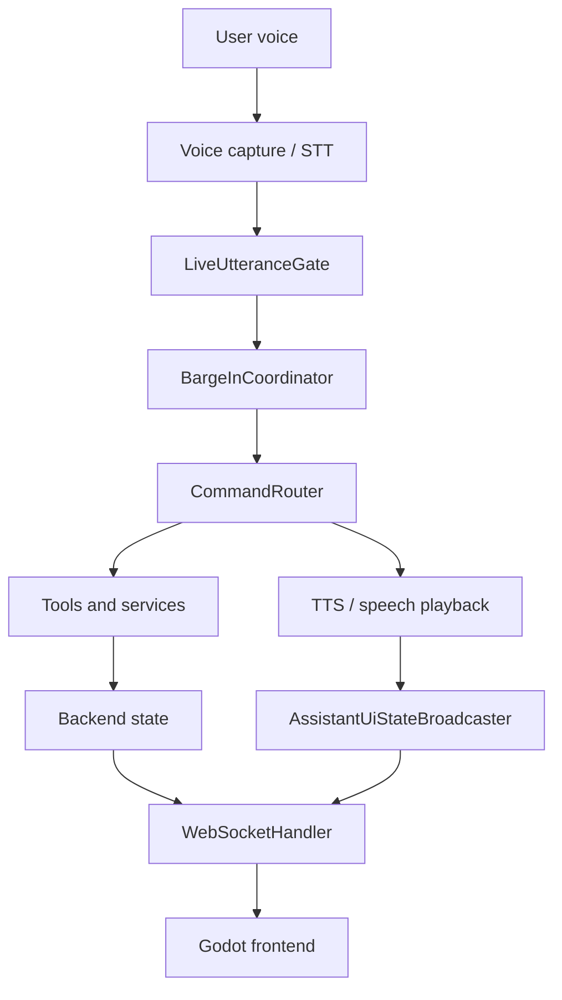
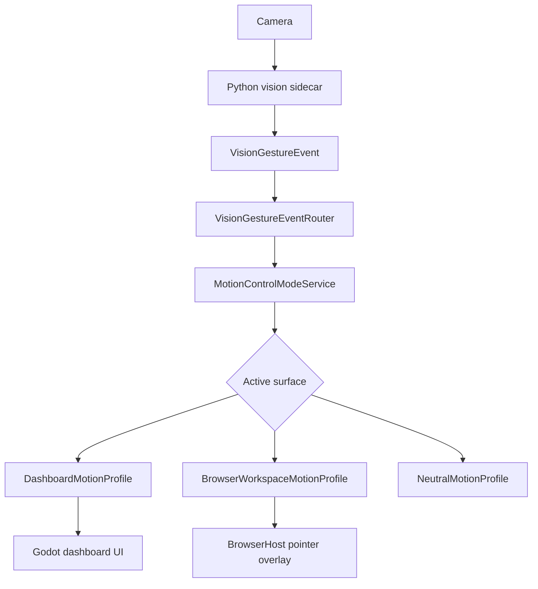
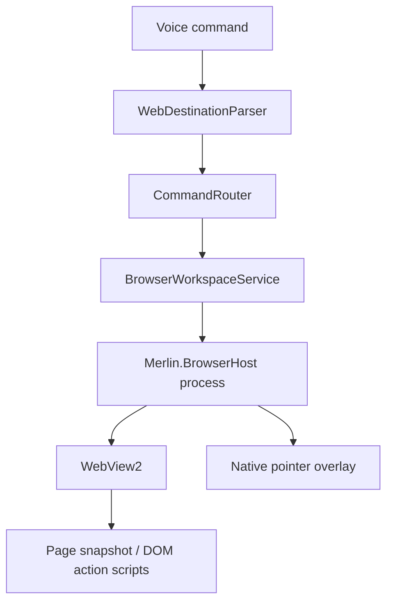

# Current System Map

## Voice Runtime

## Motion Runtime

## Browser Runtime

## Notes

- Active Surface is implemented and currently covers dashboard, browser workspace, and unknown surfaces.
- Motion profiles are implemented in backend services and selected by active surface.
- BrowserHost controls final screen click location for the browser pointer.
