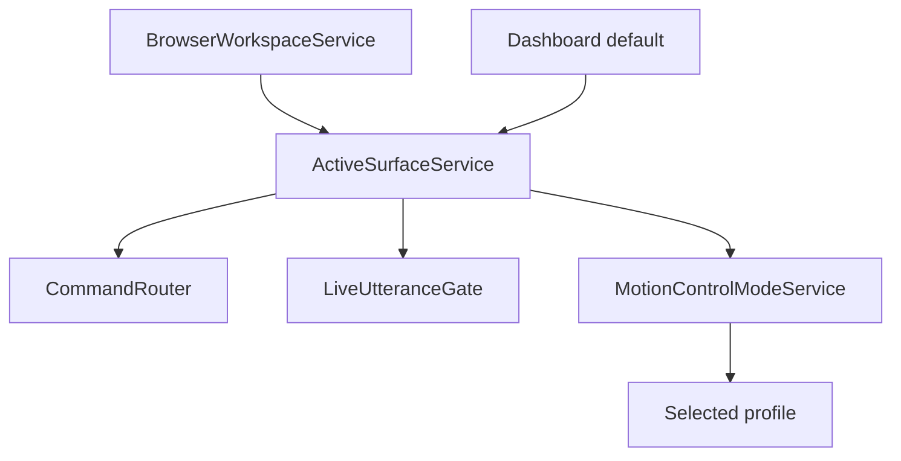

# Active Surface Architecture

## Purpose

Document context layer that tells Merlin which surface is active.

## Current Design

`IActiveSurfaceService`, `ActiveSurfaceService`, `KnownSurfaces`, capabilities, and tests exist. Browser workspace updates active surface; CommandRouter and LiveUtteranceGate read it.

## Planned Design

Future surfaces: external app, file browser, widgets, gesture target state, learned profile integration.

## Main Components

- `IActiveSurfaceService`
- `ActiveSurfaceService`
- `ActiveSurfaceSnapshot`
- `KnownSurfaces`
- CommandRouter and LiveUtteranceGate consumers

## Data / Event Flow

Surface changes emit state; routing reads current surface; motion profiles switch on changes.

## Mermaid Diagram

## Code Map

| File | Role |
| --- | --- |
| `Merlin.Backend/Services/Context/ActiveSurface/IActiveSurfaceService.cs` | Interface. |
| `Merlin.Backend/Services/Context/ActiveSurface/ActiveSurfaceService.cs` | Current state. |
| `Merlin.Backend/Services/Context/ActiveSurface/KnownSurfaces.cs` | Surface definitions. |

## Important Decisions

- Active Surface before app-specific routing.

## Risks

- Browser close/reset can leave stale state.
- External app focus is not implemented.

## Open Questions

- Should dashboard widgets publish granular surfaces?

## Related Notes

- [[Active Surface Layer]]
