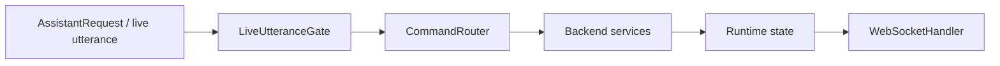

# Backend Architecture

## Purpose

Map backend responsibilities.

## Current Design

Backend owns routing, memory, safety, browser orchestration, speech playback, interruption handling, active surface, and motion profile dispatch.

## Planned Design

Keep new systems behind services and tests; avoid bloating CommandRouter further.

## Main Components

- `CommandRouter`
- `LiveUtteranceGate`
- `BargeInCoordinator`
- `BrowserWorkspaceService`
- `ActiveSurfaceService`
- `MotionControlModeService`
- memory services under `Core/Memory`

## Data / Event Flow

Requests enter through HTTP/WebSocket/voice routing, resolve into service/tool actions, and emit responses/state.

## Mermaid Diagram

## Code Map

| File | Role |
| --- | --- |
| `Merlin.Backend/Program.cs` | DI and hosted services. |
| `Merlin.Backend/Services/CommandRouter.cs` | Main routing switchboard. |
| `Merlin.Backend/Services/LiveUtterance/LiveUtteranceGate.cs` | Live utterance gate. |

## Important Decisions

- Active Surface should be checked before ambiguous browser/media commands.

## Risks

- CommandRouter is large and accumulates feature logic.

## Open Questions

- When should browser/media routing move fully into surface-aware routers?

## Related Notes

- [[Command Routing Architecture]]
