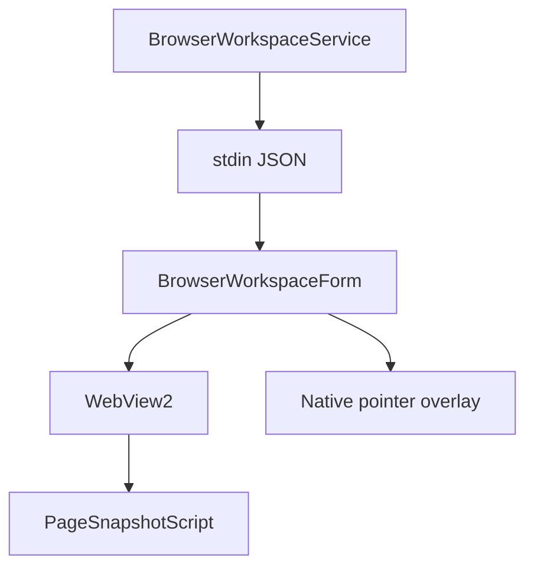

# BrowserHost Architecture

## Purpose

Document the separate WebView2 host.

## Current Design

BrowserHost is a WinForms process with WebView2, page scripts, native input, and native pointer overlay.

## Planned Design

Future site/app profiles should build on page snapshots and learned profiles, not hard-coded guesses in generic browser control.

## Main Components

- `BrowserWorkspaceForm`
- `BrowserWorkspaceCommand`
- `NativeBrowserPointerOverlayWindow`
- `NativeBrowserInputService`
- JS scripts

## Data / Event Flow

Backend sends JSON commands over stdin; BrowserHost logs/results through stdout; WebView2 executes scripts.

## Mermaid Diagram

## Code Map

| File | Role |
| --- | --- |
| `Merlin.BrowserHost/BrowserWorkspaceForm.cs` | Main command loop. |
| `Merlin.BrowserHost/NativeBrowserPointerOverlayWindow.cs` | Native overlay. |
| `Merlin.BrowserHost/CommonActionScript.cs` | Generic media/common actions. |

## Important Decisions

- BrowserHost owns final pointer click location.

## Risks

- Z-order/lifecycle fragility.
- DPI/multi-monitor uncertainty.

## Open Questions

- How should host closure reset Merlin UI state?

## Related Notes

- [[Browser Workspace]]
