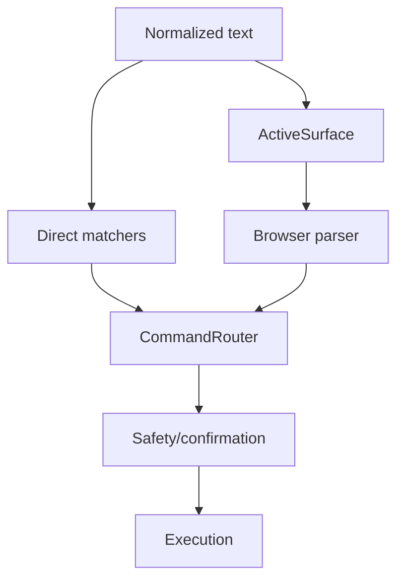

# Command Routing Architecture

## Purpose

Explain command routing from text to action.

## Current Design

CommandRouter handles direct command matchers, browser destination commands, UI/motion commands, confirmation/correction, tools, and parser fallback.

## Planned Design

Move toward context-aware routing where Active Surface selects target and safety remains independent.

## Main Components

- `CommandRouter`
- `WebDestinationParser`
- `UiControlModeCommandMatcher`
- `LiveUtteranceGate`
- intent routers

## Data / Event Flow

Text -> normalization -> command matchers -> parser/tool/service -> response.

## Mermaid Diagram

## Code Map

| File | Role |
| --- | --- |
| `Merlin.Backend/Services/CommandRouter.cs` | Main routing and execution. |
| `Merlin.Backend/Services/Web/WebDestinationParser.cs` | Browser commands. |
| `Merlin.Backend/Services/SpokenCommandNormalizer.cs` | Voice cleanup. |

## Important Decisions

- Routing context decides WHERE; safety decides WHETHER.

## Risks

- CommandRouter has many responsibilities.
- Ambiguous pause/play/stop needs active-surface discipline.

## Open Questions

- What should be extracted first?

## Related Notes

- [[Active Surface Architecture]]
