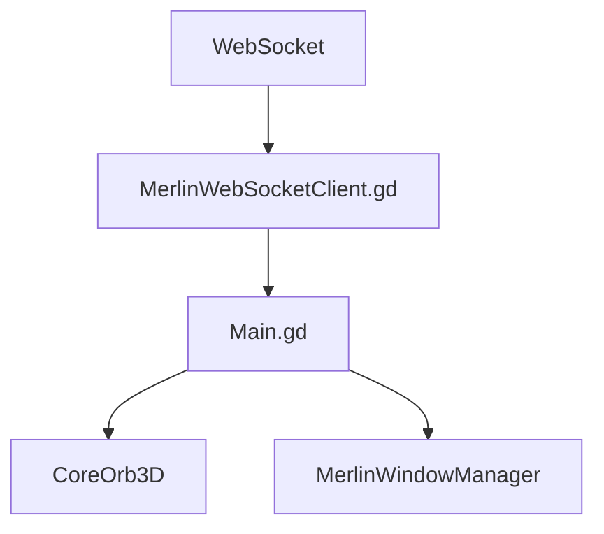

# Frontend Architecture

## Purpose

Map Godot UI responsibilities.

## Current Design

Godot frontend renders the orb, chat/log overlays, windows, dashboard UI, and receives backend events over WebSocket.

## Planned Design

Future work should keep reusable windows/widgets structured and avoid embedding all gesture behavior in `Main.gd`.

## Main Components

- `Main.gd`
- `MerlinWebSocketClient.gd`
- `CoreOrb3D.gd`
- `UI/Windows/*`

## Data / Event Flow

Backend sends JSON events; frontend updates UI state and dashboard windows.

## Mermaid Diagram

## Code Map

| File | Role |
| --- | --- |
| `Merlin.Frontend/Scripts/Main.gd` | Main UI orchestration. |
| `Merlin.Frontend/Scripts/MerlinWebSocketClient.gd` | Backend connection. |

## Important Decisions

- Dashboard motion and browser motion should remain separate.

## Risks

- Dashboard gesture logic is still centralized.

## Open Questions

- Should frontend publish granular active surfaces?

## Related Notes

- [[Dashboard UI Control]]
