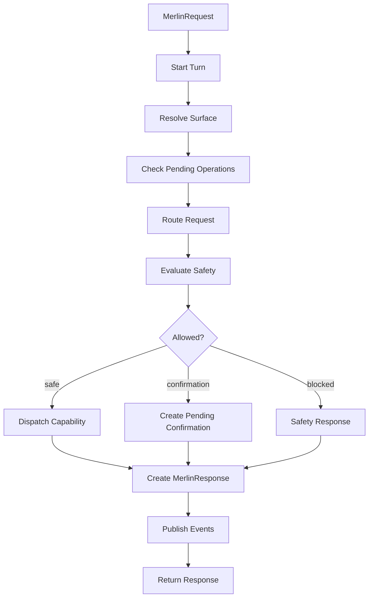

# Kernel Brainstem Architecture

## Purpose

`Merlin.Kernel` is the feature-neutral runtime coordinator.

It is not the assistant brain. It does not perform semantic reasoning itself. It is the brainstem: it receives signals, coordinates state, dispatches capability handlers, enforces safety gates, and delivers responses.

## Responsibilities

The kernel owns cross-feature runtime concepts:

| Area | Kernel Responsibility |
| --- | --- |
| Requests | Define `MerlinRequest`, input source, metadata, correlation IDs. |
| Turns | Create, track, cancel, and complete `MerlinTurnContext`. |
| Routing | Define route contracts and accept route decisions from router/planner services. |
| Capabilities | Register descriptors, dispatch handlers, standardize results. |
| Surfaces | Resolve active surface and expose surface capabilities. |
| Events | Publish turn/capability/safety/surface/interruption events. |
| Safety | Run general safety/confirmation gate before side effects. |
| Presentation | Convert capability results into speakable/displayable/output-specific responses. |
| State | Own cross-module runtime state such as pending operations, active turn, busy/speaking state. |

## Non-Responsibilities

The kernel must not know:

- YouTube selectors;
- BrowserHost stdin/stdout protocol details;
- Whisper model details;
- Chatterbox/Piper worker details;
- DeepInfra/Ollama HTTP request shape;
- memory database schema;
- trusted app executable resolution details;
- Godot node names;
- Discord API details;
- Spotify API details;
- native input implementation details.

The kernel may know that a capability called `browser.media.pause` exists. It must not know how that pause happens.

## Core Runtime Flow



## Proposed Core Types

### MerlinRequest

```csharp
public sealed record MerlinRequest
{
    public string RequestId { get; init; } = "";
    public string? UserText { get; init; }
    public MerlinInputSource Source { get; init; }
    public string? SourceSessionId { get; init; }
    public string? RequestedSurfaceId { get; init; }
    public DateTimeOffset CreatedAt { get; init; }
    public IReadOnlyDictionary<string, object?> Metadata { get; init; }
}
```

### MerlinTurnContext

```csharp
public sealed class MerlinTurnContext
{
    public string TurnId { get; }
    public MerlinRequest Request { get; }
    public ActiveSurfaceSnapshot Surface { get; private set; }
    public RouteDecision? Route { get; private set; }
    public CancellationToken CancellationToken { get; }
    public TurnState State { get; }

    public void SetSurface(ActiveSurfaceSnapshot surface);
    public void SetRoute(RouteDecision route);
    public void AddEvent(MerlinEvent evt);
}
```

### RouteDecision

```csharp
public sealed record RouteDecision
{
    public RouteDecisionKind Kind { get; init; }
    public string? CapabilityId { get; init; }
    public string? TargetSurfaceId { get; init; }
    public double Confidence { get; init; }
    public string? Reason { get; init; }
    public IReadOnlyDictionary<string, object?> Arguments { get; init; }
}
```

### CapabilityDescriptor

```csharp
public sealed record CapabilityDescriptor(
    string Id,
    string ModuleId,
    string DisplayName,
    string Description,
    IReadOnlyList<string> ExampleUtterances,
    IReadOnlySet<string> RequiredSurfaceCapabilities,
    CapabilityRiskLevel RiskLevel);
```

### CapabilityResult

```csharp
public sealed record CapabilityResult
{
    public CapabilityResultKind Kind { get; init; }
    public string CapabilityId { get; init; } = "";
    public string? UserFacingText { get; init; }
    public object? Payload { get; init; }
    public SafetyDecision? SafetyDecision { get; init; }
    public string? ErrorCode { get; init; }
}
```

## Pending Operations

The kernel owns generic pending operation mechanics.

Examples:

| Pending Operation | Owner Module | Purpose |
| --- | --- | --- |
| `confirmation` | Kernel + module policy | User must confirm before side effect. |
| `clarification` | Conversation/Voice | Next utterance answers assistant clarification. |
| `interruption_clarification` | Voice/Conversation | Next live utterance belongs to interruption handling. |
| `browser_visual_target_selection` | Browser/Motion | User points at correct UI target. |

Kernel responsibilities:

1. store pending operation;
2. define owner and timeout;
3. ensure next matching input is consumed by the owner;
4. publish state changes;
5. clean up on timeout/cancel.

## Presentation

The kernel should standardize the result shape before adapters deliver it.

```csharp
public sealed record MerlinResponse
{
    public ResponseKind Kind { get; init; }
    public string? SpeakableText { get; init; }
    public string? DisplayText { get; init; }
    public bool ShouldSpeak { get; init; }
    public IReadOnlyList<MerlinUiAction> UiActions { get; init; }
    public IReadOnlyDictionary<string, object?> Metadata { get; init; }
}
```

Examples:

| Input Source | Default Output |
| --- | --- |
| voice | speak + UI event |
| text box | display + optional speech depending mode |
| Discord future | Discord message |
| browser event | UI event or silent update |
| motion gesture | visual feedback / action result |

## Events

Kernel events should describe runtime facts without leaking implementation details.

Examples:

```text
TurnStarted
TurnRouted
CapabilitySelected
CapabilityStarted
CapabilityCompleted
CapabilityFailed
SafetyDecisionMade
ConfirmationRequested
ClarificationRequested
PendingOperationCreated
PendingOperationConsumed
PendingOperationExpired
SurfaceChanged
ResponseReady
TurnCompleted
TurnCancelled
```

## State Ownership Rule

Use this rule:

```text
If many modules need it, kernel state.
If only one module needs it, module state.
If it is an external connection/client, adapter state.
```

Examples:

| State | Owner |
| --- | --- |
| active turn | Kernel |
| active surface | Kernel surface service |
| pending confirmation | Kernel |
| browser process handle | Browser module / BrowserHost adapter |
| TTS worker process | Voice module / TTS adapter |
| memory DB context | Memory module |
| DeepInfra circuit state | DeepInfra adapter |
| Godot WebSocket sessions | Godot/WebSocket adapter |

## Risks

| Risk | Mitigation |
| --- | --- |
| Kernel becomes a new god class. | Kernel coordinates only; modules own behavior. |
| Kernel duplicates existing `CommandRouter`. | Introduce contracts first, then route through explicit capabilities. |
| Pending state is split across systems. | Centralize generic pending operation mechanics. |
| Cancellation/interruption gets lost. | Turn context owns cancellation; voice publishes interruption events. |

## Related Notes

- [[Modular Runtime Architecture]]
- [[Strangler Migration Architecture]]
- [[Capability Id Routing And Dynamic Surfaces]]
- [[Kernel Contracts Shadow Bridge Plan]]
