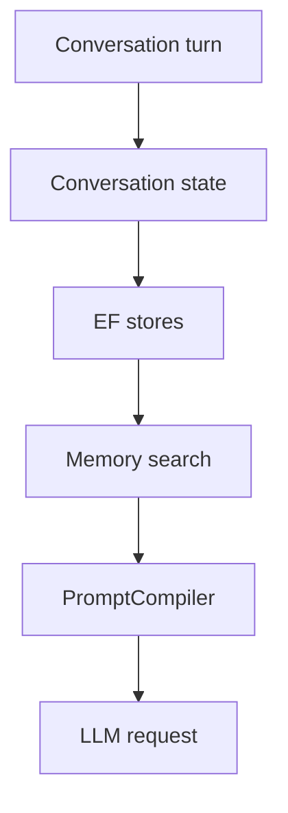

# Memory Architecture

## Purpose

Document long-term and conversational memory.

## Current Design

Memory exists under `Core/Memory` with records, stores, prompt compilation, topic boundaries, associative retrieval, user facts, and EF persistence.

## Planned Design

Future work should follow existing memory roadmaps and avoid rebuilding storage primitives.

## Main Components

- memory models
- EF repositories
- MemoryOrchestrator
- PromptCompiler
- MemoryWriter

## Data / Event Flow

Conversation state and memories are persisted, searched, summarized, and rendered into prompts.

## Mermaid Diagram

## Code Map

| File | Role |
| --- | --- |
| `Merlin.Backend/Core/Memory/Services/MemoryOrchestrator.cs` | Memory orchestration. |
| `Merlin.Backend/Core/Memory/Services/PromptCompiler.cs` | Prompt assembly. |

## Important Decisions

- Do not rebuild memory storage.

## Risks

- Prompt/token budgeting and quality remain concerns.

## Open Questions

- Which historical memory docs are fully reflected in code?

## Related Notes

- [[Memory System]]
