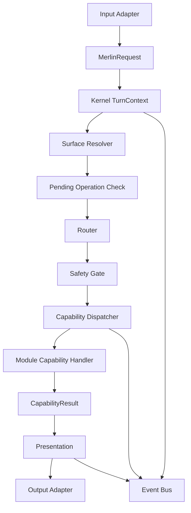

# Modular Runtime Architecture

## Purpose

This note defines the planned architecture for moving Merlin from a feature-accumulated backend into a modular runtime that is easier to extend safely.

The target structure is:

```text
Merlin.Host
  Program.cs
  app startup only

Merlin.Kernel
  Requests
  Turns
  Routing
  Capabilities
  Surfaces
  Events
  Safety
  Presentation
  State

Merlin.Modules.Browser
  BrowserWorkspace
  BrowserHost adapter boundary
  Browser surface provider
  Browser capabilities
  Browser safety rules

Merlin.Modules.Voice
  Speech playback
  Barge-in
  STT/TTS ports
  Interruption integration
  Voice state

Merlin.Modules.Memory
  Memory capabilities
  Memory extraction
  Memory retrieval
  Profile facts

Merlin.Modules.Apps
  App open/close/focus
  Trusted apps
  System commands

Merlin.Modules.Web
  Web search
  Web research
  Source handling

Merlin.Modules.Conversation
  General chat
  no_tool
  clarification
  fallback behavior

Merlin.Adapters
  WebSocket
  Godot frontend
  Windows audio
  DeepInfra
  Ollama/local AI
  BrowserHost IPC
```

The goal is not to create many deployed services. The goal is a modular monolith: one local backend process with clean ownership boundaries.

## Current Design

Current backend behavior is concentrated in broad service folders and central routers.

Important current seams include:

| Current Area | Current Role | Refactor Pressure |
| --- | --- | --- |
| `Program.cs` | Composition root for many unrelated systems. | Startup becomes hard to reason about as features grow. |
| `CommandRouter` | Routing, normalization, tool execution, confirmations, progress, responses. | Too much behavior is centralized in one route path. |
| `ToolRegistry` / tools | String/intent-driven dispatch. | New features compete in command matching. |
| `IntentRouting` | Better direction for capability/domain routing. | Still not the only source of truth. |
| `ActiveSurfaceService` | Current dashboard/browser context. | Needs dynamic registry and module-owned surface providers. |
| `BrowserWorkspaceService` | Browser lifecycle, page actions, state, IPC, active surface, safety bridge. | Should become a Browser module. |
| `AssistantSpeechPlaybackService` / `BargeInCoordinator` | Voice playback/interruption/audio orchestration. | Should become Voice module internals. |
| `appsettings.json` | Global config for many unrelated subsystems. | Needs feature-owned settings files. |

## Planned Design

The planned design separates four responsibilities:

| Layer | Owns | Must Not Own |
| --- | --- | --- |
| Host | Process startup, DI composition, configuration loading, runtime mode selection. | Feature behavior. |
| Kernel | Requests, turns, capability dispatch, surface context, events, safety pipeline, pending state, presentation contracts. | Browser selectors, STT/TTS implementation, memory DB internals, app-specific behavior. |
| Modules | Feature capabilities and feature state. | Concrete external integrations if a clean adapter should exist. |
| Adapters | External systems and infrastructure clients. | Feature policy, assistant routing, cross-feature state. |

## Main Components

### Host

The host should eventually be boring:

```csharp
builder.Configuration.AddMerlinSettings(builder.Environment);

builder.Services.AddMerlinHost();
builder.Services.AddMerlinKernel();
builder.Services.AddMerlinModules();
builder.Services.AddMerlinAdapters();

app.MapMerlinEndpoints();
```

The host decides which runtime mode is active:

- `Legacy`
- `Shadow`
- `Hybrid`
- `NextFirst`
- `NextOnly`

### Kernel

The kernel is Merlin's brainstem.

It coordinates:

- request intake;
- turn lifecycle;
- active surface resolution;
- pending operation consumption;
- route decision;
- capability execution;
- safety/confirmation;
- response presentation;
- events and state updates.

It does not implement feature behavior.

### Modules

Modules own vertical slices.

Example:

```text
Apps module
  app.open
  app.focus
  app.close
  trusted app seed data
  app action safety policy
```

Browser module owns browser behavior. Voice module owns voice behavior. Memory module owns memory behavior.

### Adapters

Adapters turn outside-world details into ports the modules/kernel can use.

Examples:

- DeepInfra adapter implements `IReasoningModelClient`.
- Ollama adapter implements `ILocalReasoningModelClient` or the same model interface.
- BrowserHost adapter implements `IBrowserHostClient`.
- Windows audio adapter implements audio input/output ports.
- Godot WebSocket adapter implements frontend output/input ports.

## Data / Event Flow

Planned turn flow:



## Capability Flow

Capabilities are explicit IDs, not implicit `CanHandle(string)` matches.

Examples:

```text
app.open
app.focus
browser.open
browser.media.pause
browser.page.click
memory.search
memory.save
web.search
conversation.chat
voice.stop_speaking
```

A route decision should say:

```text
CapabilityId = browser.media.pause
TargetSurfaceId = browser.tab.youtube
Confidence = 0.91
SafetyIntent = safe
```

The kernel dispatches the selected capability to the registered handler.

## Surface Flow

Surfaces are dynamic.

Examples:

```text
dashboard.main
browser.workspace
browser.tab.youtube
spotify.widget
discord.channel
windows.file_explorer
```

A module can register surfaces and surface capabilities.

Browser module can say:

```text
current surface = browser.tab.youtube
capabilities = browser.media.pause, browser.media.skip_ad, browser.page.click
```

This lets a command like `pause` route differently depending on context.

## Safety Boundaries

Safety remains non-negotiable.

Routing may decide where a request should go. Safety decides whether it may execute.

Safety checks must remain centralized as a pipeline contract, with module-owned policies.

Examples:

| Capability | Safety Source |
| --- | --- |
| `browser.page.click` | Browser module policy + BrowserPageSafetyGuard. |
| `app.close` | Apps module policy. |
| `memory.save` | Memory privacy/lifecycle policy. |
| `discord.send_message` future | Messaging safety policy. |

No module should bypass kernel safety gates for externally visible or destructive actions.

## Migration Model

This architecture must be introduced through a strangler migration.

```text
Legacy runtime stays active.
Next runtime is built beside it.
Requests are mirrored in shadow mode.
Next handles only explicitly enabled capabilities.
Legacy remains fallback.
Feature ownership moves slice by slice.
```

## Important Decisions

1. Do not split into many C# projects first.
2. First create `Merlin.Backend/Next` style folders inside the existing backend.
3. Load feature settings files before moving behavior.
4. Introduce shadow/hybrid runtime modes before executing actions through the new runtime.
5. Migrate by vertical capability slices, not by abstract layers.
6. Move voice and browser late because they are high-risk and stateful.

## Risks

| Risk | Mitigation |
| --- | --- |
| Big-bang rewrite breaks voice/browser/interruption. | Use shadow/hybrid strangler migration. |
| New kernel becomes another giant `CommandRouter`. | Kernel may coordinate but must not implement feature behavior. |
| Modules become thin wrappers around old services forever. | Use explicit cutover table and retirement criteria. |
| Parallel systems double-execute actions. | Shadow mode must be read-only; hybrid mode has per-capability ownership. |
| Settings split creates many small haystacks. | Add Settings README/index and typed validation. |
| Tests miss live WebView2/Godot/audio behavior. | Keep manual validation checklists for live-only systems. |

## Related Notes

- [[Backend Architecture]]
- [[Command Routing Architecture]]
- [[Active Surface Architecture]]
- [[Safety and Confirmation Architecture]]
- [[Voice Pipeline Architecture]]
- [[Browser Workspace Architecture]]
- [[Modular Runtime Refactor Master Plan]]
- [[Feature-Owned Settings Migration Plan]]
