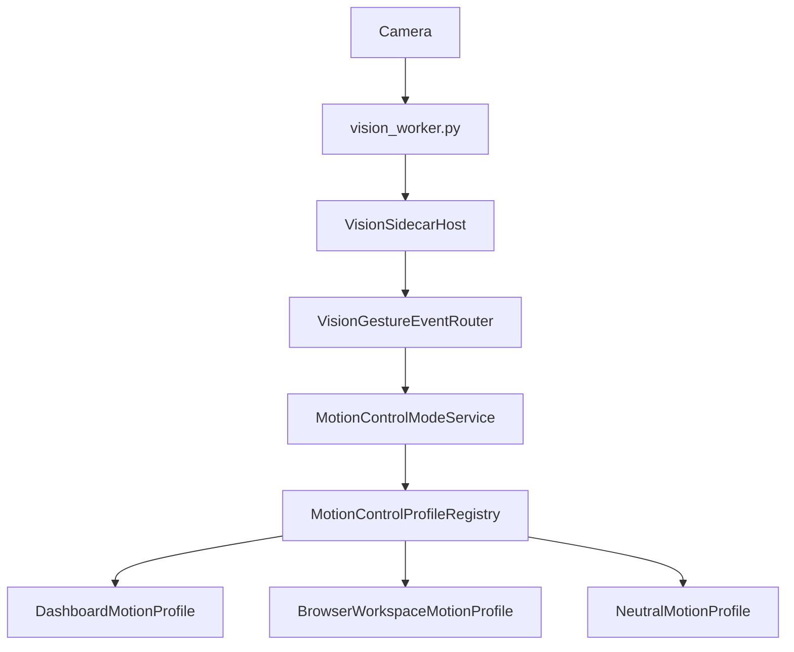

# Motion Architecture

## Purpose

Document camera gesture routing and motion profiles.

## Current Design

Vision sidecar emits gestures; VisionGestureEventRouter delegates to MotionControlModeService when available; registry chooses Dashboard, BrowserWorkspace, or Neutral based on Active Surface.

## Planned Design

Future app/site profiles should depend on active surface, page-aware control, and learned profile DB.

## Main Components

- `VisionSidecarHost`
- `vision_worker.py`
- `VisionGestureEventRouter`
- `MotionControlModeService`
- profile classes
- browser pointer/pinch/scroll services

## Data / Event Flow

Camera -> vision sidecar -> gesture event -> motion service -> active profile -> dashboard or browser action.

## Mermaid Diagram

## Code Map

| File | Role |
| --- | --- |
| `Merlin.Backend/Services/Vision/VisionSidecarHost.cs` | Sidecar lifecycle. |
| `Merlin.Backend/Services/Motion/MotionControlModeService.cs` | Profile mode service. |
| `Merlin.Backend/VisionScripts/vision_worker.py` | Camera worker. |

## Important Decisions

- One active profile consumes gestures.

## Risks

- Camera angle and reachable region limitations.
- Raw browser click safety gap.

## Open Questions

- Should learned profiles consume high-level gestures?

## Related Notes

- [[Motion Control]]
