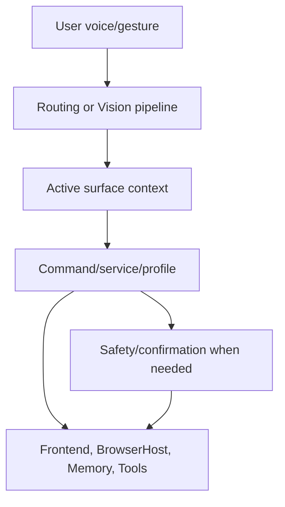

# Motion Architecture

## Purpose

Vision sidecar emits gestures; backend motion profiles dispatch to dashboard or browser consumers.

## Current Design

Current implementation is distributed across the files in the component table. The vault treats code as source of truth and separates implemented behavior from plans.

## Planned Design

Future design should build on verified foundations only: active surface first, safety before execution, and profiles before app-specific behavior.

## Main Components

| Component | File / Class | Responsibility |
| --- | --- | --- |
| CommandRouter | `Merlin.Backend/Services/CommandRouter.cs` | Routes commands where relevant. |
| ActiveSurfaceService | `Merlin.Backend/Services/Context/ActiveSurface/ActiveSurfaceService.cs` | Current surface context. |
| BrowserWorkspaceService | `Merlin.Backend/Services/BrowserWorkspace/BrowserWorkspaceService.cs` | Browser host and page actions where relevant. |
| MotionControlModeService | `Merlin.Backend/Services/Motion/MotionControlModeService.cs` | Motion profile owner where relevant. |

## Data / Event Flow

See linked flow notes for exact call/message paths. In short, user voice and visual/motion inputs enter backend routing, which dispatches to services or emits frontend/BrowserHost messages.

## State Ownership

| State | Owner | Readers | Writers | Reset Conditions |
| --- | --- | --- | --- | --- |
| Active surface | `ActiveSurfaceService` | CommandRouter, LiveUtteranceGate, motion registry | BrowserWorkspaceService and future surface producers | Browser close/reset to Dashboard |
| Motion enabled/profile | `MotionControlModeService` | VisionGestureEventRouter, tests | CommandRouter/profile switch | `eyes closed`, profile activation failure |
| Browser host lifecycle | `BrowserWorkspaceService` | browser motion/page services | open/close/host-exit handlers | host exit/close |
| Playback state | `AssistantSpeechPlaybackService` | UI broadcaster, interruption services | playback start/pause/resume/stop | final answer completed/cancelled |

## Safety Boundaries

Routing decides where a command goes. Safety decides whether it may execute. ActiveSurface and motion profiles must never bypass BrowserPageSafetyGuard or confirmation for risky actions.

## Mermaid Diagram

## Important Decisions

- [[ADR-0002 Active Surface Before App-Specific Routing]]
- [[ADR-0003 Motion Profiles Over One Global Motion Mode]]
- [[ADR-0005 Safety Does Not Get Bypassed By Routing Context]]

## Known Fragility

- Some behavior is still centralized in large scripts/services.
- BrowserHost/native overlay lifecycle and DPI behavior need live validation.
- Voice correction/barge-in tests currently fail and should be treated as blockers for learning features.

## Open Questions

- Which runtime observations should be promoted into permanent code atlas notes after the next validation session?

## Related Notes

- [[Code Atlas Index]]
- [[Voice Command Flow]]
- [[Motion Gesture Dispatch Flow]]
- [[Browser Workspace Flow]]
- [[MotionControlModeService]]
- [[Motion Profile Selection Flow]]
