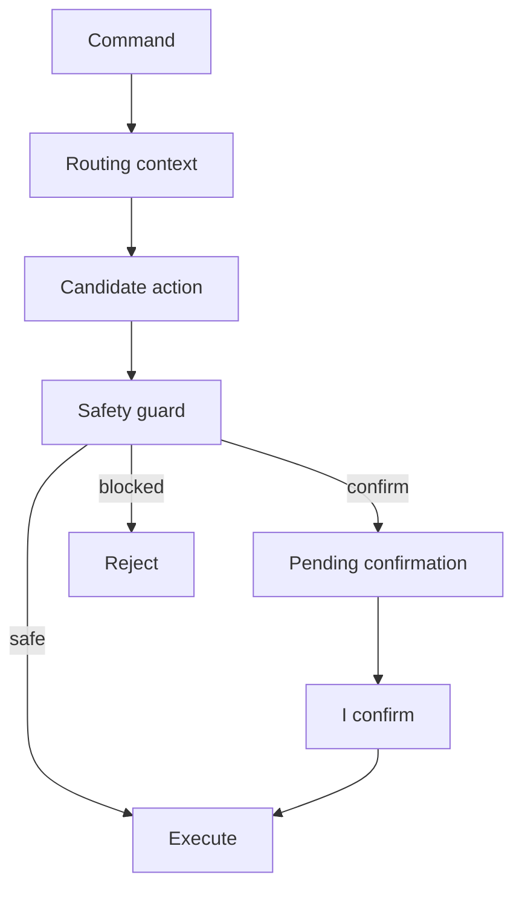

# Safety and Confirmation Architecture

## Purpose

Document action safety and confirmation boundaries.

## Current Design

BrowserPageSafetyGuard exists for page-aware browser clicks/actions. ConfirmationService and pending confirmation models support explicit confirmations.

## Planned Design

Future external app, file browser, messaging, and learned profile actions need stronger safety policies.

## Main Components

- `BrowserPageSafetyGuard`
- `ConfirmationService`
- pending confirmation models
- stop/cancel command handling

## Data / Event Flow

Route selects target; safety classifies risk; confirmation may hold pending action; confirmed action executes.

## Mermaid Diagram

## Code Map

| File | Role |
| --- | --- |
| `Merlin.Backend/Services/BrowserWorkspace/PageControl/Safety/BrowserPageSafetyGuard.cs` | Browser action safety. |
| `Merlin.Backend/Services/ConfirmationService.cs` | Pending confirmation. |

## Important Decisions

- Never bypass safety/confirmation systems.

## Risks

- Raw motion clicks can bypass BrowserPageSafetyGuard.

## Open Questions

- How to apply safety to learned profiles and pointer clicks?

## Related Notes

- [[Browser Page-Aware Control]]
