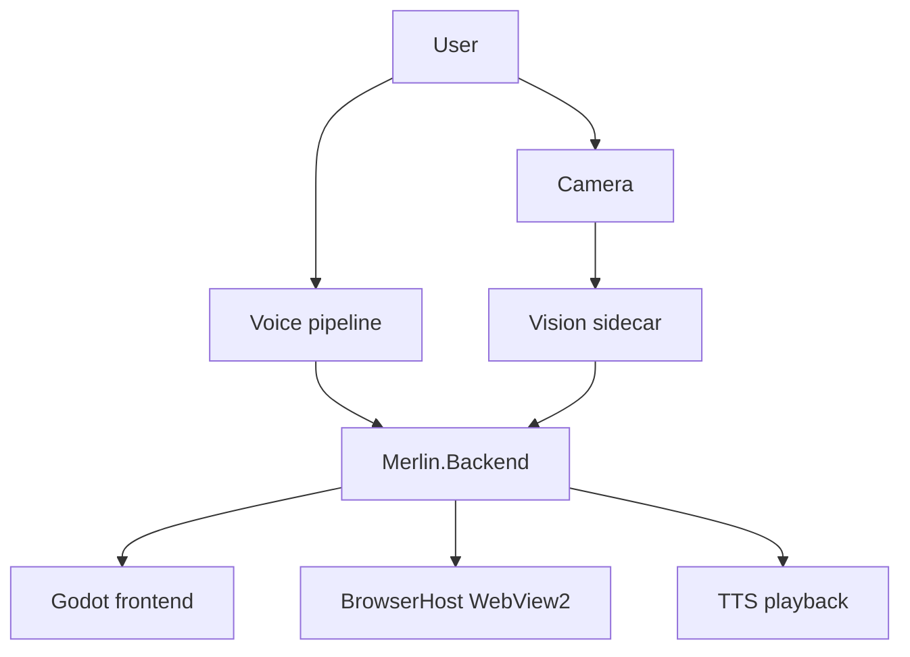

# System Architecture Overview

## Purpose

Show how Merlin runtime parts fit together.

## Current Design

Merlin currently runs as a .NET backend with WebSocket communication to a Godot UI, Python workers for voice/vision, and a separate BrowserHost process for WebView2 browsing.

## Planned Design

Future architecture should keep context routing, safety, and control profiles separated.

## Main Components

- Backend service graph via `Program.cs`.
- Godot frontend receives WebSocket events.
- BrowserHost is a child process controlled by JSON commands.
- Python workers provide STT/TTS/vision sidecars.

## Data / Event Flow

Voice and motion enter backend through separate routes, then converge on command/state updates sent to frontend or browser host.

## Mermaid Diagram

## Code Map

| File | Role |
| --- | --- |
| `Merlin.Backend/Program.cs` | Service registration. |
| `Merlin.Backend/WebSocket/WebSocketHandler.cs` | Frontend bridge. |
| `Merlin.Frontend/Scripts/Main.gd` | Main Godot UI runtime. |
| `Merlin.BrowserHost/BrowserWorkspaceForm.cs` | WebView2 host. |

## Important Decisions

- Use Active Surface for context.
- Use Motion Profiles rather than one global motion mode.
- Safety decides whether; routing decides where.

## Risks

- Cross-process lifecycle can leave stale state.
- Browser/motion safety paths are not fully unified.

## Open Questions

- Which frontend validation command should be canonical?

## Related Notes

- [[Command Routing Architecture]]
- [[Motion Architecture]]
- [[BrowserHost Architecture]]
