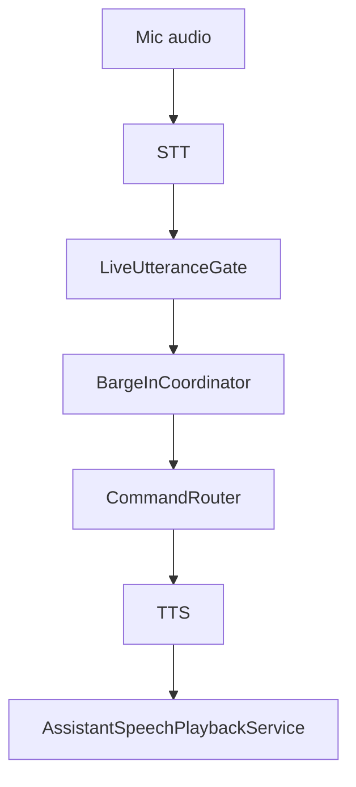

# Voice Pipeline Architecture

## Purpose

Document STT, gate, barge-in, and playback.

## Current Design

Voice capture and STT feed LiveUtteranceGate and BargeInCoordinator; accepted commands route into CommandRouter; responses use TTS and playback services.

## Planned Design

Future voice work should preserve wake/stop safety and active-surface command routing.

## Main Components

- `BargeInCoordinator`
- `LiveUtteranceGate`
- `AssistantSpeechPlaybackService`
- `ChatterboxTtsProvider`
- voice scripts

## Data / Event Flow

Voice audio -> STT -> gate -> route/interrupt -> command/correction -> TTS playback.

## Mermaid Diagram

## Code Map

| File | Role |
| --- | --- |
| `Merlin.Backend/Services/BargeIn/BargeInCoordinator.cs` | Barge-in/routing. |
| `Merlin.Backend/Services/LiveUtterance/LiveUtteranceGate.cs` | Gate. |
| `Merlin.Backend/Services/AssistantSpeechPlaybackService.cs` | Playback. |

## Important Decisions

- Global stop/cancel must remain robust.

## Risks

- Timing-sensitive tests currently fail in full suite.

## Open Questions

- Which voice tests are flaky versus currently broken?

## Related Notes

- [[Voice Interruption System]]
