# Active Surface Flow

## Summary

BrowserWorkspace and future producers update ActiveSurfaceService; CommandRouter, LiveUtteranceGate, and motion profiles consume it.

## Current Flow

1. BrowserWorkspaceService.SetBrowserWorkspaceActiveSurfaceAsync
2. ActiveSurfaceService.SetActiveSurfaceAsync
3. ActiveSurfaceChanged
4. CommandRouter/LiveUtteranceGate
5. MotionControlProfileRegistry

## Mermaid Diagram

```mermaid
flowchart LR
    N0[BrowserWorkspaceService.SetBrowserWorkspaceActiveSurfaceAsync] --> N1[ActiveSurfaceService.SetActiveSurfaceAsync]
    N1[ActiveSurfaceService.SetActiveSurfaceAsync] --> N2[ActiveSurfaceChanged]
    N2[ActiveSurfaceChanged] --> N3[CommandRouter/LiveUtteranceGate]
    N3[CommandRouter/LiveUtteranceGate] --> N4[MotionControlProfileRegistry]
```

## Related Feature And Architecture Notes

- [[Active Surface Layer]]
- [[ActiveSurfaceService]]

## Known Fragility

- Cross-process flows require lifecycle cleanup and explicit logging.
- If the active surface is stale, routing and profile selection can target the wrong consumer.
