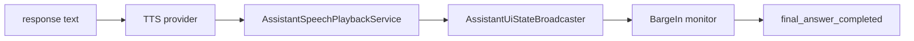

# Assistant Speech Playback Flow

## Summary

Responses become TTS audio and AssistantSpeechPlaybackService emits playback state used by UI and interruption logic.

## Current Flow

1. response text
2. TTS provider
3. AssistantSpeechPlaybackService
4. AssistantUiStateBroadcaster
5. BargeIn monitor
6. final_answer_completed

## Mermaid Diagram

## Related Feature And Architecture Notes

- [[Streaming Responses and TTS]]
- [[AssistantSpeechPlaybackService]]

## Known Fragility

- Cross-process flows require lifecycle cleanup and explicit logging.
- If the active surface is stale, routing and profile selection can target the wrong consumer.
