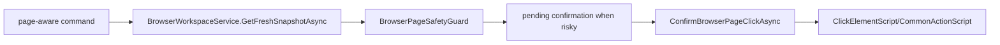

# Browser Page Action Safety Flow

## Summary

Page-aware actions evaluate snapshot/action risk through BrowserPageSafetyGuard before confirmation/action execution; raw native motion clicks remain outside this guard.

## Current Flow

1. page-aware command
2. BrowserWorkspaceService.GetFreshSnapshotAsync
3. BrowserPageSafetyGuard
4. pending confirmation when risky
5. ConfirmBrowserPageClickAsync
6. ClickElementScript/CommonActionScript

## Mermaid Diagram

## Related Feature And Architecture Notes

- [[Safety and Confirmation]]
- [[BrowserPageSafetyGuard]]

## Known Fragility

- Cross-process flows require lifecycle cleanup and explicit logging.
- If the active surface is stale, routing and profile selection can target the wrong consumer.
