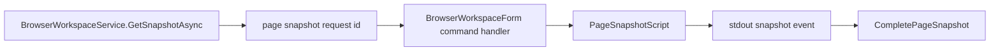

# Browser Page Snapshot Flow

## Summary

Backend requests a DOM snapshot from BrowserHost and completes a pending snapshot task when the host returns the result.

## Current Flow

1. BrowserWorkspaceService.GetSnapshotAsync
2. page snapshot request id
3. BrowserWorkspaceForm command handler
4. PageSnapshotScript
5. stdout snapshot event
6. CompletePageSnapshot

## Mermaid Diagram

## Related Feature And Architecture Notes

- [[Browser Page-Aware Control]]
- [[BrowserWorkspaceService]]

## Known Fragility

- Cross-process flows require lifecycle cleanup and explicit logging.
- If the active surface is stale, routing and profile selection can target the wrong consumer.
