# Browser Pinch Click Flow

## Summary

Pinch gestures can fire a native browser click, but raw clicks do not yet go through BrowserPageSafetyGuard.

## Current Flow

1. gesture.pinch.start/move/end
2. BrowserPinchClickController.HandleGestureAsync
3. BrowserPinchClickStateMachine
4. BrowserWorkspaceService.FireBrowserPointerClickAsync
5. browser_pointer_click
6. NativeBrowserInputService

## Mermaid Diagram

```mermaid
flowchart LR
    N0[gesture.pinch.start/move/end] --> N1[BrowserPinchClickController.HandleGestureAsync]
    N1[BrowserPinchClickController.HandleGestureAsync] --> N2[BrowserPinchClickStateMachine]
    N2[BrowserPinchClickStateMachine] --> N3[BrowserWorkspaceService.FireBrowserPointerClickAsync]
    N3[BrowserWorkspaceService.FireBrowserPointerClickAsync] --> N4[browser_pointer_click]
    N4[browser_pointer_click] --> N5[NativeBrowserInputService]
```

## Related Feature And Architecture Notes

- [[Browser Pinch Click]]
- [[Safety and Confirmation]]

## Known Fragility

- Cross-process flows require lifecycle cleanup and explicit logging.
- If the active surface is stale, routing and profile selection can target the wrong consumer.
