# Browser Pointer Flow

## Summary

Pointer gestures map into BrowserHost overlay state.

## Current Flow

1. VisionGestureEvent pointer
2. BrowserMotionOverlayModeService.UpdatePointerAsync
3. BrowserPointerMapper.Map
4. BrowserWorkspaceService.UpdateBrowserPointerOverlayAsync
5. browser_pointer_state
6. NativeBrowserPointerOverlayWindow.ApplyState

## Mermaid Diagram

```mermaid
flowchart LR
    N0[VisionGestureEvent pointer] --> N1[BrowserMotionOverlayModeService.UpdatePointerAsync]
    N1[BrowserMotionOverlayModeService.UpdatePointerAsync] --> N2[BrowserPointerMapper.Map]
    N2[BrowserPointerMapper.Map] --> N3[BrowserWorkspaceService.UpdateBrowserPointerOverlayAsync]
    N3[BrowserWorkspaceService.UpdateBrowserPointerOverlayAsync] --> N4[browser_pointer_state]
    N4[browser_pointer_state] --> N5[NativeBrowserPointerOverlayWindow.ApplyState]
```

## Related Feature And Architecture Notes

- [[Browser Pointer Overlay]]
- [[BrowserPointerMapper]]

## Known Fragility

- Cross-process flows require lifecycle cleanup and explicit logging.
- If the active surface is stale, routing and profile selection can target the wrong consumer.
