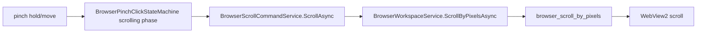

# Browser Scroll Gesture Flow

## Summary

Pinch-hold movement scrolls WebView2 through BrowserHost.

## Current Flow

1. pinch hold/move
2. BrowserPinchClickStateMachine scrolling phase
3. BrowserScrollCommandService.ScrollAsync
4. BrowserWorkspaceService.ScrollByPixelsAsync
5. browser_scroll_by_pixels
6. WebView2 scroll

## Mermaid Diagram

## Related Feature And Architecture Notes

- [[Browser Scroll Gestures]]
- [[BrowserScrollCommandService]]

## Known Fragility

- Cross-process flows require lifecycle cleanup and explicit logging.
- If the active surface is stale, routing and profile selection can target the wrong consumer.
