# Browser Workspace Flow

## Summary

Backend BrowserWorkspaceService launches and commands Merlin.BrowserHost over stdin/stdout JSON.

## Current Flow

1. CommandRouter/browser service
2. BrowserWorkspaceService.OpenAsync
3. Merlin.BrowserHost process
4. BrowserWorkspaceForm stdin loop
5. WebView2 action
6. stdout event
7. BrowserWorkspaceService.HandleHostOutputLineAsync

## Mermaid Diagram

```mermaid
flowchart LR
    N0[CommandRouter/browser service] --> N1[BrowserWorkspaceService.OpenAsync]
    N1[BrowserWorkspaceService.OpenAsync] --> N2[Merlin.BrowserHost process]
    N2[Merlin.BrowserHost process] --> N3[BrowserWorkspaceForm stdin loop]
    N3[BrowserWorkspaceForm stdin loop] --> N4[WebView2 action]
    N4[WebView2 action] --> N5[stdout event]
    N5[stdout event] --> N6[BrowserWorkspaceService.HandleHostOutputLineAsync]
```

## Related Feature And Architecture Notes

- [[Browser Workspace]]
- [[BrowserWorkspaceService]]

## Known Fragility

- Cross-process flows require lifecycle cleanup and explicit logging.
- If the active surface is stale, routing and profile selection can target the wrong consumer.
