# BrowserWorkspace Motion Profile Flow

## Summary

Browser profile enables overlay and routes gestures to browser pointer/click/scroll controllers.

## Current Flow

1. BrowserWorkspaceMotionProfile.ActivateAsync
2. BrowserMotionOverlayModeService.EnableAsync
3. HandleGestureAsync
4. UpdatePointerAsync
5. BrowserPinchClickController.HandleGestureAsync
6. BrowserWorkspaceService command

## Mermaid Diagram

```mermaid
flowchart LR
    N0[BrowserWorkspaceMotionProfile.ActivateAsync] --> N1[BrowserMotionOverlayModeService.EnableAsync]
    N1[BrowserMotionOverlayModeService.EnableAsync] --> N2[HandleGestureAsync]
    N2[HandleGestureAsync] --> N3[UpdatePointerAsync]
    N3[UpdatePointerAsync] --> N4[BrowserPinchClickController.HandleGestureAsync]
    N4[BrowserPinchClickController.HandleGestureAsync] --> N5[BrowserWorkspaceService command]
```

## Related Feature And Architecture Notes

- [[Browser Control]]
- [[BrowserWorkspaceMotionProfile]]

## Known Fragility

- Cross-process flows require lifecycle cleanup and explicit logging.
- If the active surface is stale, routing and profile selection can target the wrong consumer.
