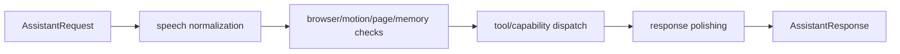

# Command Router Flow

## Summary

CommandRouter.RouteAsync evaluates motion/browser/memory/tool paths and returns AssistantResponse.

## Current Flow

1. AssistantRequest
2. speech normalization
3. browser/motion/page/memory checks
4. tool/capability dispatch
5. response polishing
6. AssistantResponse

## Mermaid Diagram

## Related Feature And Architecture Notes

- [[Command Routing Architecture]]
- [[CommandRouter]]

## Known Fragility

- Cross-process flows require lifecycle cleanup and explicit logging.
- If the active surface is stale, routing and profile selection can target the wrong consumer.
