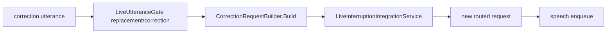

# Correction Flow

## Summary

Correction utterances build replacement requests and try to cancel/replace active turns, but current CorrectionRegeneration tests fail.

## Current Flow

1. correction utterance
2. LiveUtteranceGate replacement/correction
3. CorrectionRequestBuilder.Build
4. LiveInterruptionIntegrationService
5. new routed request
6. speech enqueue

## Mermaid Diagram

## Related Feature And Architecture Notes

- [[Correction Layer]]
- [[CorrectionRequestBuilder]]

## Known Fragility

- Cross-process flows require lifecycle cleanup and explicit logging.
- If the active surface is stale, routing and profile selection can target the wrong consumer.
