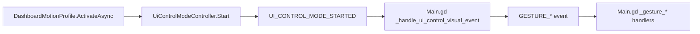

# Dashboard Motion Profile Flow

## Summary

Dashboard profile starts UI control mode and frontend Main.gd interprets dashboard gestures.

## Current Flow

1. DashboardMotionProfile.ActivateAsync
2. UiControlModeController.Start
3. UI_CONTROL_MODE_STARTED
4. Main.gd _handle_ui_control_visual_event
5. GESTURE_* event
6. Main.gd _gesture_* handlers

## Mermaid Diagram

## Related Feature And Architecture Notes

- [[Dashboard UI Control]]
- [[Main.gd]]

## Known Fragility

- Cross-process flows require lifecycle cleanup and explicit logging.
- If the active surface is stale, routing and profile selection can target the wrong consumer.
