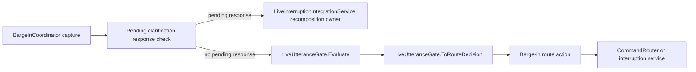

# Live Utterance Flow

## Summary

Barge-in captured utterances are classified by LiveUtteranceGate before being accepted, clarified, ignored, or turned into a replacement/correction route.

## Current Flow

1. BargeInCoordinator capture
2. PendingInterruptionClarificationService consumes a pending clarification response if one exists
3. Consumed pending responses are handed to LiveInterruptionIntegrationService for PR10.4e recomposition ownership
4. If no pending response is consumed, LiveUtteranceGate.Evaluate
5. LiveUtteranceGate.ToRouteDecision
6. Barge-in route action
7. CommandRouter or interruption service

## Mermaid Diagram

## Related Feature And Architecture Notes

- [[Voice Interruption System]]
- [[LiveUtteranceGate]]

## Known Fragility

- Cross-process flows require lifecycle cleanup and explicit logging.
- If the active surface is stale, routing and profile selection can target the wrong consumer.
- Pending clarification response ownership, awaiting state, timeout cleanup, stale handling watchdog, and full PR10.4e recomposition ownership exist.
