# Motion Control Enable Flow

## Summary

`eyes open` style commands route to MotionControlModeService, which resolves the active profile and starts vision tracking when needed.

## Current Flow

1. CommandRouter.RouteAsync
2. MotionControlModeService.EnableAsync
3. ActiveSurfaceService.GetCurrentAsync
4. MotionControlProfileRegistry.Resolve
5. profile.ActivateAsync
6. VisionSidecarHost.StartTrackingAsync

## Mermaid Diagram

```mermaid
flowchart LR
    N0[CommandRouter.RouteAsync] --> N1[MotionControlModeService.EnableAsync]
    N1[MotionControlModeService.EnableAsync] --> N2[ActiveSurfaceService.GetCurrentAsync]
    N2[ActiveSurfaceService.GetCurrentAsync] --> N3[MotionControlProfileRegistry.Resolve]
    N3[MotionControlProfileRegistry.Resolve] --> N4[profile.ActivateAsync]
    N4[profile.ActivateAsync] --> N5[VisionSidecarHost.StartTrackingAsync]
```

## Related Feature And Architecture Notes

- [[Motion Control Profile Layer]]
- [[MotionControlModeService]]

## Known Fragility

- Cross-process flows require lifecycle cleanup and explicit logging.
- If the active surface is stale, routing and profile selection can target the wrong consumer.
