# Motion Gesture Dispatch Flow

## Summary

Python emits gestures, backend parses them, and MotionControlModeService dispatches to the active profile.

## Current Flow

1. vision_worker.py emit
2. VisionSidecarHost.HandleOutputLineAsync
3. VisionGestureEventRouter.RouteAsync
4. MotionControlModeService.HandleGestureAsync
5. active profile HandleGestureAsync
6. Dashboard or BrowserHost consumer

## Mermaid Diagram

```mermaid
flowchart LR
    N0[vision_worker.py emit] --> N1[VisionSidecarHost.HandleOutputLineAsync]
    N1[VisionSidecarHost.HandleOutputLineAsync] --> N2[VisionGestureEventRouter.RouteAsync]
    N2[VisionGestureEventRouter.RouteAsync] --> N3[MotionControlModeService.HandleGestureAsync]
    N3[MotionControlModeService.HandleGestureAsync] --> N4[active profile HandleGestureAsync]
    N4[active profile HandleGestureAsync] --> N5[Dashboard or BrowserHost consumer]
```

## Related Feature And Architecture Notes

- [[Motion Architecture]]
- [[VisionGestureEventRouter]]

## Known Fragility

- Cross-process flows require lifecycle cleanup and explicit logging.
- If the active surface is stale, routing and profile selection can target the wrong consumer.
