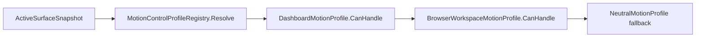

# Motion Profile Selection Flow

## Summary

ActiveSurface drives profile selection through MotionControlProfileRegistry.

## Current Flow

1. ActiveSurfaceSnapshot
2. MotionControlProfileRegistry.Resolve
3. DashboardMotionProfile.CanHandle
4. BrowserWorkspaceMotionProfile.CanHandle
5. NeutralMotionProfile fallback

## Mermaid Diagram

## Related Feature And Architecture Notes

- [[Motion Profile Architecture]]
- [[MotionControlProfileRegistry]]

## Known Fragility

- Cross-process flows require lifecycle cleanup and explicit logging.
- If the active surface is stale, routing and profile selection can target the wrong consumer.
