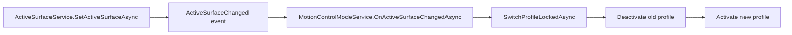

# Motion Profile Switch Flow

## Summary

ActiveSurfaceChanged while motion is enabled switches profiles.

## Current Flow

1. ActiveSurfaceService.SetActiveSurfaceAsync
2. ActiveSurfaceChanged event
3. MotionControlModeService.OnActiveSurfaceChangedAsync
4. SwitchProfileLockedAsync
5. Deactivate old profile
6. Activate new profile

## Mermaid Diagram

## Related Feature And Architecture Notes

- [[Active Surface Architecture]]
- [[MotionControlModeService]]

## Known Fragility

- Cross-process flows require lifecycle cleanup and explicit logging.
- If the active surface is stale, routing and profile selection can target the wrong consumer.
