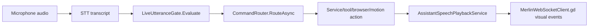

# Voice Command Flow

## Summary

Frontend or backend captures user speech, STT produces text, LiveUtteranceGate evaluates it, CommandRouter routes it, and AssistantSpeechPlaybackService speaks the response.

## Current Flow

1. Microphone audio
2. STT transcript
3. LiveUtteranceGate.Evaluate
4. CommandRouter.RouteAsync
5. Service/tool/browser/motion action
6. AssistantSpeechPlaybackService
7. MerlinWebSocketClient.gd visual events

## Mermaid Diagram

## Related Feature And Architecture Notes

- [[Voice Pipeline Architecture]]
- [[CommandRouter]]
- [[LiveUtteranceGate]]

## Known Fragility

- Cross-process flows require lifecycle cleanup and explicit logging.
- If the active surface is stale, routing and profile selection can target the wrong consumer.
